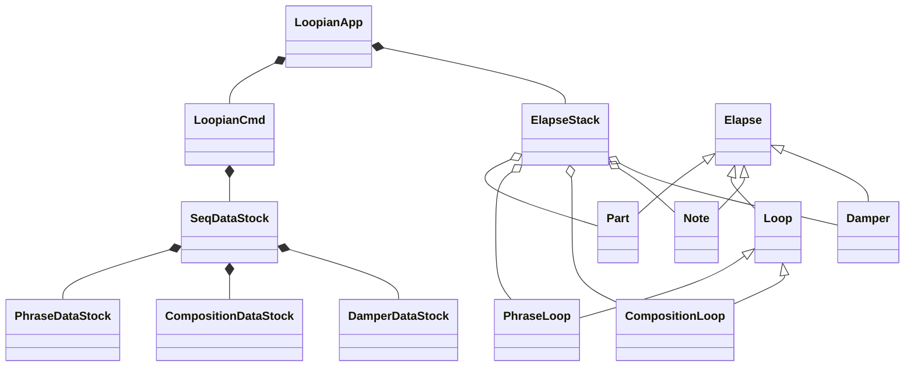
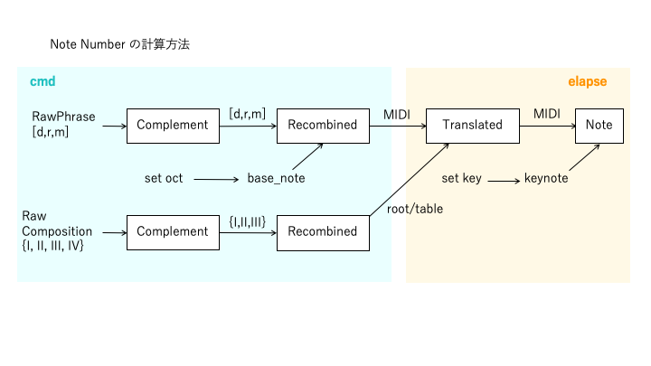

# Loopian developping memo

## Outline
### what's this

- text command による loop sequencer
- 音色はピアノを想定し、ミニマルな音楽を指向する
- script は一行単位で入力
- 移動ド(d,r,m..)による階名指定
- コード(I,II..)指定で、入力に変化を与えながらループ再生
- 自動にピアノの表現を付加
- BPM, Key, 拍子(Beat)などの基本的な音楽指示が可能
- Loopian全体像
    - Loopian::app : アプリケーション
    - Loopian::dev : PCに接続する専用ハード
    - Loopian::script : スクリプト言語
    - Loopian::tg
    - Loopian::txt

### what you can do

- Live Coding
- A part of Musical Performance
- Loop Sequencer
- Musical Education
- Dynamic Easy Listening
- Interactive Art(with Device)

## Spec.
### piano 専用 Realtime Loop Generator (Text Sequencer)

- Input Part は4つ
    - L(L1), L2, R(R1), R2
- Pedal 用隠しパートが一つ
- MIDI ch. は一つ

### 出力 MIDI

- Note On/Off
- Sustain CC#64
- Reverb Depth CC#91
- Volume CC#7

### コマンド入力

- コマンドには以下の4種類がある
    - Phrase Command（ [] で入力）
    - Composition Command（{}で入力）
    - Realtime Control Command (play/stop/fine/rit./left/right/sync)
    - Setting Command (set [bpm/beat/oct/key/input/samenote])
- Phrase Command の考え方
    - User は、ノート番号と音価、簡易な表情指示(Music Expression)を入力
    - exp.engine は、簡易な表情指示からベロシティ、微妙なタイミング、dulation、ペダル情報を自動生成
- Composition Command と、自動和音変換
    - Composition で指定された和音に従って、Phrase 入力の音は自動変換される
    - Composition も、各パートごとに設定する
    - 全体に同じ Composition を適用したい場合、全パート入力モードにする
- 各パートの Phrase も、Composition も、それぞれ独自の周期で loop する
- Phrase の Music Expression 一覧
    - ff,f,mf,mp,p,pp,ppp  （ベロシティ指定）
    - ped, noped （ペダル奏法）
    - artic: stacc,legato,marc （dulation指定）
    - p->f など音量の漸次的変化
- Composition の Music Expression 一覧
    - para  （コード変換の指定）

## Design
### Class diagram

### Elapse Object

- 用語定義
    - Elapse Object: 時間経過をもつオブジェクト
    - ElapseIF Class: Elapse Object の最上位の抽象クラス、ほぼIF
    - Elapse Stack Class: 全ての Elapse Object を集約し、周期に従いコールする処理を行う

- 再生されるデータは全て Elapse Object の継承 Object が出力
    - Elapse Object は全て ElapseIF Class から継承される
    - 以下の Class が継承されている
        - Part Class
        - Loop Class(Phrase/Composition)
        - Note/Pedal Class

- Elapse Object は、Elapse Stack Class(estk) で管理される
    - estk は Elapse Object をリストに繋げる
    - periodic() で各 Elapse Object の process() をコールする
        - 各 Elapse Object は、next_tick, next_msr で次回に呼ばれるタイミングを返す
        - next_tick/next_msr の値に準じて、estk は順序通りに Elapse Object をコール
    - estk が Elapse Object をコールしてメッセージを送る、という流れが基本
        - Elapse Object が、逆流してメッセージを流したいとき、estk へのポインタは保持できないので、process() の引数の 
          estk で処理を完結させる
        - 末端の Elapse Object から全体の Object にメッセージを送る機能追加 register_sp_cmnd() 

### Text Parse処理の考え方

- 入力文字一覧
    - 全体区切り: [],{},(),@
    - 複数音符を跨ぐ指定子: <,>,/,|,*,:
    - 一音符内の指定子: (1:-,+)(2:',",q,h,3,5,`)(3:d,r,m,f,s,l,t,x)(3':i,a)(4:^,%)(5:.,~,o)
        - 3と3'を合わせたものは =,_ で繋いで同時発音を表現できる
        - 1は、2の後に置いても機能する
    - まだ使われていない文字: w,e,r,y,u,p,a,j,k,z,c,v,b,n,!,?,;,\,&,$,
    - 一和音内の指定子: (1:I,V)(2:#/b)(3:[table name])(4:@[n])(5:.)
    - 同じ意味に使う文字 : 小節(/,|)、同時(=,_)、タイ(.,~)

### Phrase 入力から再生までの変換の流れ

|変換順|name|名前|説明|変更タイミング|他原因|
|-|-|-|-|-|-|
|1|raw|生|ユーザーが入力した生データ|入力時(static)||
|2|complement|補填|生データに補填、追加したデータ|入力時||
|3|recombined|再構成|SMF的な、tick/note/velocity をセットにしたデータ|入力時|composition/bpm/beat/key/oct|
|4|analysed|分析|コード変換時に自然な変換をするための分析データ|入力時||
|5|humanized|生演奏|velocity/duration を生演奏に近づけたデータ|入力時||
||||◆ここまでのデータが次のLoop先頭でロード◆|||
|6|randomized|分散|変化量を分散したデータ|Loop頭(dynamic)||
|7|translated|変換|コードの反映|再生時(dynamic)||

- 上記のうち最初の５つは、ユーザーによるphrase入力時に処理される(static)
- 再生中、リアルタイムに最後の二つの処理が行われる(dynamic)
- 上記の各データが、他の要因で変更されるタイミングは以下
    - phrase が入力されたら、最初からやり直し(set_raw())
    - composition が入力されたら、「再構成」からやり直し(set_recombined())
    - bpm/beat/key/oct が変わったら、「再構成」からやり直し
    - 再生中に Loop がひとまわりするたびに「分散」処理を行う(get_final())

- Pedalデータは各パートの Loop 冒頭に以下の処理を行う
    - コード情報があれば、ペダルを踏む
    - コード情報がない、あるいは noped 指定の場合はペダルを踏まない

### Composition 入力から再生までの変換の流れ

|変換順|name|名前|説明|変更タイミング|他原因|
|-|-|-|-|-|-|
|1|raw|生|ユーザーが入力した生データ|入力時(static)||
|2|complement|補填|生データに補填、追加したデータ|入力時||
|3|recombined|再構成|SMF的な、tick/chord をセットにしたデータ|入力時|beat|

### Rust 版の Message の流れ

- thread は以下の二つ
    - main() 内の eframe::run_native() : Main thread
    - stack_elapse::ElapseStack::periodic() : Play thread
- 二つのスレッドは、それぞれ別の Message を受信できる
    - スレッド間でメッセージを送る Rust の機能 mspc::channel を使用する
    - mspc::channel は複数のスレッドから、一つのスレッドにメッセージを送れるが、今回は１対１の関係とする
    - LoopianApp::new() で二つの mspc::channel() がつくられ、各スレッドが受信するよう設定される

### Note 処理

- octave は、Phrase生成時に足しこむ
- key は、再生時に足しこむ

### Analysed でやっていること

- 時間単位での Phrase 情報の整列
    - Note単位での再生情報を、時間単位に変換（和音指定を一つの単位に凝縮）
    

### Filter

- [raw] を指定しない限り、勝手に exp.engine によるフィルタがかけられる
- Humanization Filter(5.humanizedで適用)
    - 強拍/弱拍(linear) -> velocity [実装済み]
        - bpm が高いほど強調(bpm:72-180)
    - 時間間隔(Non-linear) -> velocity/duration
        - Note OffとNote Onの間隔は、短い音符になるほど、時間一定になりやすい
        - 細かい音符は大きな velocity で弾くことは困難(limit)
    - 未来密度、過去密度(linear) -> velocity/duration
        - 密度：現在より２拍以内（未満ではない）にある音符×距離の総和
        - 過去密度が高く、未来密度が低い場合、フレーズの終わりとみなし、velocity/duration は減らす
        - 過去密度が低く、未来密度が高い場合、フレーズの開始とみなし、volocity をちょっと減らす
        - 両密度とも高いとき、少し強め
    - 音高平均との差(linear) -> velocity
        - フレーズの平均音高より離れていると、velocity は強くなる
- Translation Filter(7.translatedで適用)
    - Common
        - テーブルを通した一番近い音に変更
    - Arpeggio
        - 連続して同じ音が出ない
        - 四分音符未満の長さに適用
    - Parallel
        - 音程全体を、ルート音の音高分だけ平行移動する

### Tempo 生成の考え方

- ElapseStack Class 内で動作する TickGenerator Class にてテンポ生成を行う
    1. Tempo 変化時の絶対時間とその時点の tick を記録
    2. 次に Tempo が変わるまで、その時間との差から、現在の tick を算出する

- この Class 内に rit. 機構を持つ
    - rit. は基本的にテンポを一定比率で落としていく
    - rit. 終了は次（の次）の小節の頭
    - テンポが一定比率で落ちる場合、Tickは２次関数的に減っていく

### 次にやること
- アルペジオで連続して同じ音が出ないようにする -> 同音回避型和音変換対応　10/7済
- | を小節区切り対応　10/10済
- 左手用に、平行移動型の和音変換、Music Expressionへの追加(trans:para/parallel)　10/12済
- Composition を４つのパート独立に設定できる　10/13済
- 音価指定を階名の[]の中に組み入れる、音価用の[]をやめる　済
- 各パートのイベントのタイミングを合わせる大幅な修正　済
- Pedal On/Off の Music Expressionへの追加(noped)　12/17済
- ',",q,hによる冒頭の音価設定　1/1済
- 特定のタイミングだけ強くしたり、弱くする phrase 表記追加　1/4済
- rit. の種類実装, rit. -> Fine 1/13済

当面の対応
- 1part内に複数ループを登録し、Compositionの中でセレクト出来るようにする
    - '+' で連結するのを止める 1/14済
    - @2[....] と入れた瞬間に、最初の phrase が終わったら、2 の phrase を再生する
    - {I/V7@2} コードの後ろに@付き番号があったら、このタイミングでその番号の phrase の変更を行う

先の話
- コピペ対応
- 現在のループをひとまとめで取っておき、簡単な指示で呼び出し可能とする(snapshot)
- さらなる humanized アルゴリズムの追加
- Load/Save機能、Auto Load/Play機能

## Rust 化の順番
- とりあえずテキスト入力で音が鳴る(2023/2/23)
- humanized 対応 2/25済
- Composition のテキスト変換 2/28済
- Part内のPhrase,Composition合体 3/3済
- Chordのcmdからloopまでの伝達 3/4済
- Chord情報の再生 3/4済
- octave/key切替 3/5済
- Analyzed対応
- Chord情報による音程変換
- Part切替
- Beat切替
- pedal 対応
- 8 indicator 全表示
- Rondamized 対応
- Log File対応
- fine 対応
- rit 対応

## loopian 計画
- loopian を使った動画制作
- loopian::dev によるリアルタイム演奏

### 動画作成
- QuickTime Player で新規画面収録
- 単体: 画面サイズ 896 * 504 (16:9)
  Pianoteq8付きサイズ 1600 * 900
  全体で録画して、iMovieの中で単体を切り出し、Pianoteq8の切り出しをピクチャインピクチャで上に載せる
- オーディオ出力 : 複数出力装置（BlackHole & xxxのスピーカー）
    - DAWの出力も確認
- 録音設定 : オプションから BlackHole 2ch を選択
- Audio MIDI -> オーディオ装置 -> 「複数出力装置」選択 -> マスター装置: BlackHole 2ch
- iMovieに入れるが、YouTubeではなく、ファイル出力指定にする(1080p 60)
- 紹介文
Live Coding by Loopian & Pianoteq8

Loopian is a real-time loop sequencer that describes notes by text.
It is designed to be played primarily in Piano tones.
Usages:
    - Generating music by entering text in real-time in the style of Live Coding
    - Loop-based phrase transformations in real-time for performance, interactive art, etc.
    - Solmization practice in music education with movable-do

Loopian github:
https://github.com/hasebems/Loopian

Loopian は、テキストで音符を指定するリアルタイムループシーケンサです。
主に Piano 音色で演奏されることを前提に開発しています。
使用用途：
    - Live Coding 風にリアルタイムにテキストを入力して音楽を生成
    - ループベースのフレーズをリアルタイムに変容させるパフォーマンス、インタラクティブアートなどへの応用
    - 音楽教育における、移動ドによるソルミゼーション実践

tag: #livecoding  #midi  #piano  #python  #pianoteq
