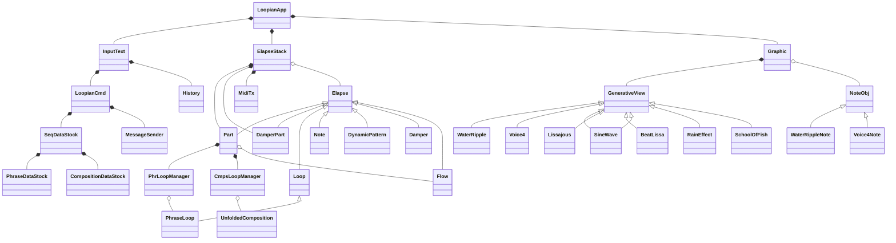

# Loopian developping memo

## Outline
### 1.what's this

- text ベースの loop sequencer
- 音色はピアノを想定し、ミニマルな音楽を指向する
- script は一行単位で入力
- 移動ド(d,r,m..)による階名指定
- コード(I,II..)指定で、入力に変化を与えながらループ再生
- 自動にピアノの表現を付加
- BPM, Key, 拍子(Beat)などの基本的な音楽指示が可能
- Loopian System
    - Loopian::APP : 本アプリケーション
    - Loopian::ORBIT : PCに接続する専用ハードウェア
    - Loopian::QUBIT : HW小型版
- Loopian::ORBIT を使ってリアルタイム演奏が可能
    - 一つの Part を、リアルタイム用に指定
    - 演奏を自動的にコード指定に合わせて MIDI 出力する
- テキストと同時に、音再生とリンクしたグラフィックを表示

### 2.what you can do

1. Live Coding
1. A part of Musical Performance
1. Loop Sequencer
1. Musical Education
1. Dynamic Easy Listening
1. Interactive Art(with Device)

## Spec.

### 1.Command体系

- 全般的なコマンド体系
    - Object.Command.Fn() の形に統一
        - 各要素はピリオドで繋ぐ
    - Object 種類
        - APP系: 本アプリ全体
        - Control系、Set系は Object はない
        - ALL, L1, L12 : パートの Object
        - graph: 画面を表す Object
    - APP は概念的な Object なので記載しない
    - Part Object は、入力パートと同じなら省略可能
        - `L1.[d,r,m]`  => L1>`[d,r,m]`
    - Fn() は必要に応じていくつでも後ろに追加できる
    - Fn() は、引数がなくても () をつける必要がある
    - APP の Command は、先頭に ! をつける
        - ! がついた場合、log には記述されない
        - !quit/!q : アプリ終了
        - !load/!l : ファイルロード
        - !msr() : loadを特定の拍まで止める。lpnファイル内にしか書けない
        - !blk() : loadの特定部分しか読まない。lpnファイル内にしか書けない
    - part(ALL,L1,L12など) の Command
        - [], {}
        - sync, clear
    - Play系の Command
        - play/p, fermata, fine, stop, resume, rit, clear
    - Set系は、set.Fn() という形式になる
    - graph の Command
        - light, dark
    - 特殊なもの
        - @c=[] , @n=[] , @msr()=[]{}

- コマンド一覧

|Object|Command|Function|説明|
|-|-|-|-|
|[APP系]|!quit/!q||アプリ終了|
|↑|!load/!l||ファイルロード|
|↑|!clear/!c||データクリア|
|[Play系]|play/p/resume||開始、再開|
|↑|stop/fine||中止、終了|
|↑|fermata||小節頭で停止|
|↑|rit/rit.poco/rit.molto|bar(...)|小節数|
|↑|↑|bpm(.../fermata)|rit終了時のBPM|
|[Set系]|set|bpm(...)|テンポ|
|↑|↑|beat(...)|拍子|
|↑|↑|key(...)|調|
|↑|↑|oct(...)|オクターブ|
|↑|↑|path(...)|ファイルのPath|
|↑|↑|input(...)|入力モード|
|*L1/L2/R1/R2*|[...]||Phrase|
|↑|↑|dyn(...)|Velocity|
|↑|↑|dmp(...)|Damper|
|↑|↑|stacc(...)|Staccato|
|↑|↑|rpt(...)|Repeat|
|↑|↑|trans()/para()|変換方法|
|↑|{...}||Composition|
|↑|sync|||
|↑|clear|||
|[FLOW]|{...}|||
|[graph]|light/dark|||
|↑|ripple/voice/|||
|||||

- Phrase Command の考え方
    - ノート番号と音価を指示する
    - また、表情指示(Music Expression)を、さらに関数を追加して記述できる
    - exp.engine により、簡易な表情指示からベロシティ、微妙なタイミング、dulation、ペダル情報を自動生成
    - @n で phrase + Music Expression を Variation として格納できる（パート内でのみ使用可能）
- Composition Command の考え方
    - Composition では和音・スケール（ノート変換子）を指示する
    - 指定されたノート変換子に従って、Phrase 入力の音は自動変換される
    - Composition も、各パートごとに設定できる
    - @n の変数を指定することで、特定の箇所で特定の phrase 再生ができる
- Phrase も、Composition も、それぞれ独自の周期で loop する
- 音符変調関数
    - rpt(n) : repeat
    - 一つの音を複数に分割
- 音楽表現関数
    - stacc() : staccato
    - dyn() : ff,f,mf,mp,p,pp, ^, %, cresc, dim などVelocity指定
    - dmp() : on,off,half などdamper pedal奏法
    - trns() : para などコード変換方法の指定

### 2.MIDI Flow(Server)機能

- Loopian は、Window上で動作するGUI Modeと、CUI Modeで動作する二つの状態があり、起動時にオプションスイッチで指定する
    - GUI Modeは、大きさを変えられるWindowと、その中には8つのインジケータ、音に合わせたビジュアライズ機能もある
    - CUI Modeは、Windowを廃し、ターミナル/MIDI入力だけで動作可能。Server として動作させるためのもの。
    - MIDI Flow機能は、Server として動作した場合、すなわち CUI Mode の時のみ動作する
    - MIDI PC 0-15 で .lpn ファイルをロード、PC#16 でアプリを終了、PC#17でターミナル入力モードとなる
- 専用外部デバイスを接続し、インタラクティブな演奏を楽しめる機能を提供する
    - Loopian::ORBIT という専用デバイスを接続
    - Loopian::ORBIT は MIDI Note On/Off を Note Number 0-95 の範囲で出力する
    - ただし、1octaveあたり接点は16と見做すので、実際のノート番号にする際には、3/4 をかける必要がある
- Loopian の FLOW Part にコードを指定すると、Loopianを触った時に、そのコードの構成音しか出なくなる
- 演奏効果について
    - 発音は16分音符単位にクオンタイズされる
    - コード指定が無ければ、12音のNoteがそのまま鳴る
    - コード指定があれば、その中のノートに丸め込まれる
    - ペダルは１小節の間踏まれる

<!--
- Composition の Music Expression 一覧
    - 今のところ無し
-->

## Design

### 1.Generated Document

[cargo doc で自動生成](../target/doc/loopian/index.html)

### 2.Class diagram

- MidiRx は、gen_midirx_thread() 内で生成される
- LoopianServer は、cui_loop() 内で生成される

### 3.Elapse Object

- 用語定義
    - Elapse Object: 時間経過をもつオブジェクト
    - ElapseIF Class: Elapse Object の最上位の抽象クラス、ほぼIF
    - Elapse Stack Class: 全ての Elapse Object を集約し、周期に従いコールする処理を行う

- 再生されるデータは全て Elapse Object の継承 Object が出力
    - Elapse Object は全て ElapseIF Class から継承される
    - 以下の Class が継承されている
        - Part Class
        - Loop Class(Phrase/Composition)
        - Note/Pedal Class

- Elapse Object は、Elapse Stack Class(estk) で管理される
    - estk は Elapse Object をリストに繋げる
    - periodic() で各 Elapse Object の process() をコールする
        - 各 Elapse Object は、next_tick, next_msr で次回に呼ばれるタイミングを返す
        - next_tick/next_msr の値に準じて、estk は順序通りに Elapse Object をコール
    - estk が Elapse Object をコールしてメッセージを送る、という流れが基本
        - Elapse Object が、集約元に逆流してメッセージを流したいとき、estk へのポインタは保持できないので、process() の引数の 
          estk で処理を完結させる
        - 末端の Elapse Object から全体の Object にメッセージを送る機能追加 register_sp_cmnd() 

- Compositionの1tick先行の仕組み
    - Part 内に、PhrLoopManager, CmpsLoopManager, DamperLoopManager というクラスが保持されている、
        - Loop 先頭で、Phrase, Composition, Damper の Loop Elapse の生成を行っている
    - Composition は、常に Phrase より先に process() が呼ばれる必要がある
        - CmpsLoopManager は Loop 先頭の 1tick 前に process() が呼ばれている
            - 呼ばれた後、現在の位置を 1tick 後に化かして、Composition の生成を行う
            - Composition の最初の process() は生成時(1tick前)にコールされる
        - Composition の process() 内において
            - 呼ばれた時の時間を 1tick 後ろにずらす
            - 次に呼ばれるべき時間を 1tick 前にずらす
            - これで全イベントが 1tick 前に動作している
        - Composition から Variation Phrase の番号を再生する場合
            - 1tick 先行して再生
            - Phrase の小節先頭で、Variation 変更のイベントを処理できる

### 4.Text Parse 処理の考え方

- 入力文字一覧
    - 全体区切り: [],{},@
    - 複数音符を跨ぐ、あるいは区切る指定子: /,|,*,<>:
    - 一音符内の指定子:
        0:>
        1:-,+               : Octave
        1': $,$L,$Q
        2:w,v,e,q,h,3,5,'   : 音価
        3:d,r,m,f,s,l,t,x,c : 階名
        3':i,a              : 階名
        4:^,%   : 強弱
        5:.,o   : 音価
        6:',~   : staccato, legato
        - 3と3'を合わせたものは、連続して音符を書くことで同時発音を表現できる
        - 1と2は順序が逆でも動作する
    - ーノート変換子内の指定子: (1:@[n]:)(2:I,V)(3:#,b)(4:[table name])(5:!)(6:.,~,')
        - !は、para/common時に、上下の音と等距離なら上側を採用することを表す
    - 関数表記: .fn()
- まだ使われていない文字: g,y,u,p,j,k,z,b,n,?,;,\,&,$,
- 同じ意味に使う文字 : 小節(/,|)

### 5.Phrase 入力から再生までの変換の流れ

|変換順|name|名前|説明|変更タイミング|他原因|
|-|-|-|-|-|-|
|1|raw|生|ユーザーが入力した生データ|入力時(static)||
|2|complement|補填|生データに補填、追加したデータ|入力時||
|3|recombined|再構成|SMF的な、tick/note/velocity をセットにしたデータ|入力時|composition/bpm/beat/key/oct|
|4|analysed|分析|コード変換時に自然な変換をするための分析データ|入力時||
|5|humanized|生演奏|velocity/duration を生演奏に近づけたデータ|入力時||
||||◆ここまでのデータが次のLoop先頭でロード◆|||
|6|randomized|分散|変化量を分散したデータ|再生時(dynamic)||
|7|translated|変換|コードの反映|再生時(dynamic)||

- 上記のうち最初の５つは、ユーザーによるphrase入力時に処理される(static)
- 再生中、リアルタイムに最後の二つの処理が行われる(dynamic)
- 上記の各データが、他の要因で変更されるタイミングは以下
    - phrase が入力されたら、最初からやり直し(set_raw())
    - composition が入力されたら、「再構成」からやり直し(set_recombined())
    - bpm/beat/key/oct が変わったら、「再構成」からやり直し
    - 再生中に Loop がひとまわりするたびに「分散」処理を行う(get_final())

- Pedalデータは各パートの Loop 冒頭に以下の処理を行う
    - コード情報があれば、ペダルを踏む
    - コード情報がない、あるいは noped 指定の場合はペダルを踏まない

### 6.Composition 入力から再生までの変換の流れ

|変換順|name|名前|説明|変更タイミング|他原因|
|-|-|-|-|-|-|
|1|raw|生|ユーザーが入力した生データ|入力時(static)||
|2|complement|補填|生データに補填、追加したデータ|入力時||
|3|recombined|再構成|SMF的な、tick/chord をセットにしたデータ|入力時|beat|

### 7.Message の流れ

- thread は以下の三つ
    - main() 内の eframe::run_native() : Main thread
    - stack_elapse::ElapseStack::periodic() : Elps thread
    - MIDI Rx thread
- 二つのスレッドは、それぞれ別の Message を受信できる
    - スレッド間でメッセージを送る Rust の機能 mspc::channel を使用する
    - mspc::channel は複数のスレッドから、一つのスレッドにメッセージを送れるが、今回は１対１の関係とする
    - LoopianApp::new() で二つの mspc::channel() がつくられ、各スレッドが受信するよう設定される
- Main から Elps へのメッセージ
    - enum ElpsMsg で定義されたメッセージを送信する
- Elps から Main へのメッセージ
    - 8 indicator に表示する値
    - 画面に表示する Note On 情報（Note Offは使わない）

### 8.Note/Damper 処理

- Note 処理
    - octave は、Phrase生成時に足しこむ
    - key は、再生時に足しこむ

- Damper 処理について
    - DamperLoop Class にて、小節の冒頭で Damper Event を生成する
    - 各パートのコード情報をマージして Damper Event 生成
        - Beat数の要素を持った MergeMap 作成
        - コード情報があれば、MergeMap のコード情報がある Beat に True 追加
        - 上記の調査結果、コードイベントごとに Pedal を踏み直す Damper Event 生成
    - 1part でも noped があれば、Damper Event は生成しない
    - MIDI flow 設定時、phrase のデータがなくても、コード情報から Damper Event 作成する

### 9.Analysed でやっていること

- 時間単位での Phrase 情報の整列
    - Note単位での再生情報を、時間単位に変換（ノート変換指定を一つの単位に凝縮）
    - 音程差を検出し、Phrase の起伏を走査する

### 10.ノート番号変換(note translation)

- ノート変換アルゴリズム
    - common: table の最も近い値を選ぶ
        - フレーズの冒頭の音に適用
        - 四分音符以上の長さの音の後の音にも適用
        - 繰り返し指定の冒頭に適用
    - parallel: phrase を平行移動した後、テーブルを通して音程を算出
        - 平行移動した後は、common と同じ処理
    - Scale&Parallel: テーブルを通した後、phrase を平行移動して音程を算出（詳細は下記）
    - arpeggio: アルペジオ判定のとき、前の音と同じにならない処理を加味して table の値を選ぶ
        - （詳細はパワポの資料参照）
        - 四分音符未満の長さに適用
- ノート変換の詳細仕様
    - コード情報と、Phrase Analysed情報をベースにノート変換を行う
    - Phrase の Music Expression 内にあるノート変換情報は Analysed に反映される
        - para
    - Chord の最後に ! を付けたとき、parallel/common の table と上下とも等距離ならば上側の音を採用
- 変換テーブルには以下の種類がある
    - Chord: 和音の種類＋ルート指定
    - Scale: key上のスケール指定
    - Scale&Parallel: key上のスケール指定＋paraによる全体移動の指定
    - その他: 種類の指定
- Scale&Parallel 仕様
    1. 教会旋法（chr,ion,dor,lyd,mix,aeo）による指定
    1. chr のみ、クロマティックスケールとなり、教会旋法ではなく、単に phrase が指定した主音だけ平行移動する
    1. para指定されていなくても、Scale&Parallel対応のノート変換が選ばれれば、自動的にpara指定になる
    1. 各旋法において、移動しない音階は以下の通りとなり、指定された音階との相対距離で全体の移動距離が決定される

        |旋法|移動しない音階指定|
        |-|-|
        |chr|I|
        |ion|I|
        |dor|II|
        |lyd|IV|
        |mix|V|
        |aeo|VI|

- ノート変換は loop object 内で発生する
    - ノート変換後に Note Object を生成

### 11.Filter

- [raw] を指定しない限り、勝手に exp.engine によるフィルタがかけられる
- Humanization Filter(5.humanizedで適用)
    - 強拍/弱拍(linear) -> velocity [実装済み]
        - bpm が高いほど強調(bpm:72-180)
    - 時間間隔(Non-linear) -> velocity/duration
        - Note OffとNote Onの間隔は、短い音符になるほど、時間一定になりやすい
        - 細かい音符は大きな velocity で弾くことは困難(limit)
    - 未来密度、過去密度(linear) -> velocity/duration
        - 密度：現在より２拍以内（未満ではない）にある音符×距離の総和
        - 過去密度が高く、未来密度が低い場合、フレーズの終わりとみなし、velocity/duration は減らす
        - 過去密度が低く、未来密度が高い場合、フレーズの開始とみなし、volocity をちょっと減らす
        - 両密度とも高いとき、少し強め
    - 音高平均との差(linear) -> velocity
        - フレーズの平均音高より離れていると、velocity は強くなる

### 12.Beat/Tempo 生成の考え方

- ElapseStack Class 内で動作する TickGenerator Class にてテンポ生成を行う
    1. Tempo 変化時の絶対時間とその時点の tick を記録
    2. 次に Tempo が変わるまで、その時間との差から、現在の tick を算出する

- この Class 内に rit. 機構を持つ
    - rit. は基本的にテンポを一定比率で落としていく
    - rit. 終了は次（の次）の小節の頭
    - テンポが一定比率で落ちる場合、Tickは２次関数的に減っていく

- 拍子(beat)が変わる時のシーケンス
    - cmd内で、全パート(phrase,composition)に recombine が発生
    - Elps thread にメッセージを送り、送られたメッセージはstockされ、syncフラグを立てる
    - 次小節の頭で、TickGen にchange_beat_event()が発生
    - syncフラグが立っているので、Partがloopに set_destroy() を送る
        - set_destroy() では、destroyフラグを立て、nextを遠い未来に設定
        - destroyフラグを立てられた phrase loop では、process では何も起きないようにする
            - 前のループの、次の拍に鳴るはずだった音を鳴らさせないため
        - 同じ時間のループ内にloopは回収される

- Tempo の揺れを作る機能

### 13.Auftakt/Arpeggio の対応 -> Loop と Phrase の長さとの関係の変更

#### 下記は新しい前提

- ヴェロシティだけでなく、タイミングもランダムにずらす
    - 拍ぴったしで鳴らなくなり、タイミングが前後にずれる
    - Phrase の冒頭も前の小節にかかる場合がある
- start の小節位置は 0:1:000 だが、Auftakt がなければ、1:1:000 の近くまで速いテンポですぐに移動
    - Auftakt がある場合は、0:2:000, 0:3:000, 0:4:000 の近くまで速いテンポで移動（四拍子の場合）

#### 実現したい仕様

- 和音同時演奏の冒頭に $ を書くと、Arpeggioになる
- このとき、和音の各音の発音タイミングを微妙にずらす
    - 基本的には beat の前にずらす
- command 部では、Arpeggio フラグ(gioFlag)を立てるだけで、実動作は Elapse 部で行う
    - Phrase の冒頭が Arpeggio になるとき、Auftakt 小節が増える扱いとする
- Elapseで、次の音符に gioFlag が立っていたら、以下の処理を行う
    - 同タイミングの他の gioFlag が立っている音符を探す
    - bpm や音価から各音のばらけのタイミングを算出
    - それらの音符をいったんgioスタックに入れて、そこから再生する
- そもそも gioFlag が立っていなくても、タイミングずらしを行う

#### Phrase 管理の方法(floating loop)

- あらたに begin_cnct, end_cnct という位置を設ける
    - phrase 先頭(begin_phr)から begin_cnct まで1小節
    - end_cnct から phrase 終了(end_phr)まで1小節
    - end_cnct が、次の Loop の begin_cnct と繋がる
    - 従って phrase は少なくとも最低3小節は持つ
        - tick_for_onemsr * 3 := minimum whole_tick
- Auftakt は、begin_phr から begin_cnct までの間に演奏される
- 入力時は楽譜通りのタイミングだが、elapseで時間軸のずらしを行う
    - 前後に足す小節は、code入力時には意識させない
    - 現在再生中の Loop が最終小節のときに、新しい Phrase を入力した場合、以下のように再生する
        - Auftakt がある場合はその直前 X tick、ない場合は最後の X tick(20以下?)までなら早送り再生
        - 上記を超えたら、現 Loop をそのまま再生し、新しい Pharase は予約となる

## 開発状況
<!--
## Rust 化の順番
- とりあえずテキスト入力で音が鳴る(2023/2/23)
- humanized 対応 2/25済
- Composition のテキスト変換 2/28済
- Part内のPhrase,Composition合体 3/3済
- Chordのcmdからloopまでの伝達 3/4済
- Chord情報の再生 3/4済
- octave/key切替 3/5済
- Analyzed対応 3/10済
- Chord情報による音程変換 3/12済
- Part切替 3/12済
- Beat切替 3/13済
- pedal 対応 3/18済
- 8 indicator 全表示 3/19済
- Rondamized 対応 3/21済
- Log File対応 3/21済
- fine 対応 3/25 済
- rit 対応 3/25 済
- sync 対応 3/25 済
- input mode/same note対応 3/25 済
- panic 対応 3/25 済
-->

<!--
- アルペジオで連続して同じ音が出ないようにする -> 同音回避型和音変換対応　10/7済
- | を小節区切り対応　10/10済
- 左手用に、平行移動型の和音変換、Music Expressionへの追加(trans:para/parallel)　10/12済
- Composition を４つのパート独立に設定できる　10/13済
- 音価指定を階名の[]の中に組み入れる、音価用の[]をやめる　済
- 各パートのイベントのタイミングを合わせる大幅な修正　済
- Pedal On/Off の Music Expressionへの追加(noped)　12/17済
- ',",q,hによる冒頭の音価設定　1/1済
- 特定のタイミングだけ強くしたり、弱くする phrase 表記追加　1/4済
- rit. の種類実装, rit. -> Fine 1/13済
- 入力時に、Note以外のイベントをデータ内に仕込める仕組みを作る： TYPE_INFO 4/12済
- <>*n の繰り返しのとき、繰り返しの頭のChord Translation Logic を Common にする　4/12済
- アルペジオ時の同音回避型変換のアルゴリズムを変更 5/1済
- MIDI in受信 5/17 済
- MIDI IN機能 6/15 ほぼ済
    - Loopian::ORBIT からの MIDI Note を接点として受信 16×6 = 96 or 8×6 = 48 [接点]
    - 実音 6octave 分の演奏が可能
    - 受信後、適切なタイミング、ノートに変換して MIDI 出力
        - ノートは、d,r,m...t のクロマティック入力がされたとみなし、特定のパートに入力(L1,L2,R1,R2)
        - タイミングは、8分音符、16分音符のどちらかにクオンタイズされる
- 入力時にオクターブ情報が無くても近接する側の階名にする Closer は、和音入力の時は効かないように変更。6/19 済
- Phrase, Compositionの入力時、冒頭に R12> というように任意のパート（複数も）を指定できるようにする 6/24 済
    - Phrase を同時入力されてもいいように、各パートのデフォルトのオクターブを完全に散らす
- para時の音程の折り返し位置を設定できる set turnnote 機能追加 6/26 済
- load 機能
    - テキスト入力Boxに、001 R1> というように番号を追加し、現在がバッファの何行目かを表示 6/21 済
    - 記録されたログファイルを、そのまま load して履歴バッファに格納できる機能 7/2 済
    - ファイルをロードした時、ロード行数だけ、上記の数値が増える 7/2 済
- Variation Phrase 機能
    - Elps 内でのデータ受信と格納 7/9 済
    - cmdparse にて、seq_stock 内(PhraseDataStock)に９つのインスタンスを生成しデータ格納 7/12 済
    - Message 送信処理、oct,key,composition などへも対応 7/14 済
    - Elps で Composition 再生時に、Variation 自動再生 7/16 済
- 入力パートの設定を、left1 の場合 L1 でもOKとした 7/29 済
- load 時、historyに入れるだけでなく、コマンド処理まで行う仕様に変更 8/5 済
- [] でフレーズを消したのに、get_phr() では、データが残っているような値が返る
    - Damper Pedal の処理で get_phr() を使っていて、起動後は何もデータが無いと、Some(x) で None が返るのに、何かのフレーズを消した後だと、None は返らない。-> 返るように修正 9/24 済
- flow で MIDI を鳴らす時、Phrase が None でも、Chord が送られていれば Pedal は送られる仕様に変更 9/24 済
- 文法の変更
    - [][mf] => [].dyn(mf) 10/21 済
    - [][noped] => [].dmp(off)  10/21 済
    - [<m,f>*5] => [m,f].rpt(5)  10/21 済
    - [][para] => [].trns(para) / [].para()  10/21 済
    - [][stacc] => [].artic(stacc) / [].stacc()  10/21 済
    - @2[...] => @2=[...] : 音符列(+関数)を格納できる変数 10/20 済
        - {I/@2;II} => {I/@2:II} 10/20 済
- Windowの背景に、水紋を表示させる 11/3 済
- 「Compositionの1tick先行の仕組み」実装時より、２拍目以降にコードイベントがあるとハングするバグ修正 11/12 済
- "'の音価指定ができない不具合修正、""、h'、q'の新しい音価指定追加 11/15 済
- 小節の残りtickより、音価が長い場合は、音価をリミットする  11/15 済
- clear 機能追加 11/18 済
- light mode 追加 12/3 済
- 入力文字数の制限をなくす 12/29 済
- c=xx による cluster memory 機能 1/3 済
- >x で parallel、<xxx> で、その区間 parallel 1/3 済
- 同時複数音入力の時、コード指定で重複して音がなるのを回避 1/3 済
- 4拍目と次の1拍目に休符を入れると、音価が伸びてしまう不具合修正 1/3 済
- load フォルダ内のpathの指定機能追加 1/4
- rit.を複数小節にわたってかける機能追加 1/14
- 弱起(Auftakt)機能 1/21
- {...//} 最後に // をつけると、Loopしなくなる機能追加 1/26
- [...]+ 複数 Phrase 追加入力機能 1/31
- [...//] Phrase にも Loopしなくなる機能追加 2/4
- 昔の phrase がときどき一度だけなってしまう不具合修正 2/6
- space key で start/stop をトグルで操作可能にした 2/11
- 音価を一律短くする処理をやめて、elapse noteにて、音価の時間に応じて短さを調整する 2/29
- variation の記法を @n:chord から chord:@n にした 3/3
- asMin()関数追加 3/7
- historyを操作すると、scrollviewがスクロールする 3/8
- stacc(nn) の nn で数値入力可能にした 3/10
- ctrl-V で clipboard の内容を入力できるようにした 3/10
- setコマンド書き方の変更 5/6
    - set bpm=120 -> set.bpm(120)
    - それに合わせて ( を書いたら ) を自動挿入（[],{}も自動挿入追加）
- wait機能追加(5/24) -> auto -> msr に変わる
- graph に voice 追加(5/28)
- [...].rpt(n)+ (nは一桁)とやることで、リピートしながら複数のフレーズを追加入力できる仕様追加 (6/1)
- load 時の、blk機能(6/5)
- flow の仕様変更 : play 中でなくても、音は出る（クロマティック＆テンポ同期しない）(6/12)
- !load.ファイル名、の後、ファイル名を覚えていて、!l のみでも再生可能とした。また !load.msr(n) で途中再生も可能とした (7/20)
- _アンダーバーによるタイ記述方法導入(8/11)
- 同時複数音の入力方法を明確にする(9/16)
    - 左から低い順とする
        - 右隣の音に、+がついてなければ、最も近い上の音になる
        - + があればそこから+の数だけ、オクターブが上がる
        - - は無視
        - [trlm] は、最初のt=B2とすると、B2,D3,A3,E4 となる
    - [A,B1B2B3,C] とあった場合、B1は、Aとの距離で±が決定され、Cは、B3との距離で±が決定される
        - [d,fdm,m] と書かれた時、d=C3とすると、C3->F3,C4,E4->E4 となる
- MIDI Txのポートが見つからなくても、アプリが起動するようにする(9/23)
- rit. の記述方法変更(9/24)
- MIDI 設定を settings.toml に書ける機能追加(9/28)
- 表示の内部message formatをstringでなくて、ちゃんとしたenumで。(9/29)
- dynamic pattern 機能(10/21)
    - Cls(), Arp() で、和音演奏、アルペジオ演奏を自動生成
- 次のループからではなく、次の小節からフレーズが差し変わる動作に変更(11/1)
    - 新しい Phrase が前の Phrase より長さが長いときに差し変わる（とりあえずの仕様）
- @msr()=[]で小節指定できる機能追加(11/1)
    - Phr, Ana のElapseへの送り方を、一つのメッセージにする
    - part, vari の引数に加え mes を追加
    - この時、vari は無効
- Phrase を入力したとき、次のループからではなく、リアルタイムで変わる機能(11/1)
    - 常に入力した次の小節先頭から変わる仕様とした
    - リアルタイムの場合、まずそれが可能なデータかチェック
        - variation には使えない
        - 小節数が新しい方が同じか多い
- 過去の特定のコマンド区間だけを save できる機能(11/2)
- !rd(n) でファイル内の !rd(n): 以降を、Input Window に呼び出す(11/2)
- efct.dmp(),cc70() を追加(11/21)
- 以降はリリース情報に追記 //
-->

パス
- cd "/Users/hasebems/Library/Mobile Documents/com~apple~CloudDocs/coding/LiveCoding/"
- cd /users/hasebems/coding/livecoding/Loopian_Rust

バグ情報、不具合の可能性（アサート情報）
- stack_elapse.rs の process() 175行目付近のアサートにひっかかるとき
    - next_msr が更新されないと、再生済みにならないので、永久ループに入ってしまう
- { //} による composition loop を設定すると、loop後も1小節だけ、最後のコードが再生されてしまう

もうやらないこと（忘れないように）
- <d,r,m>*3 で3回繰り返し、みたいな記法はとても便利だが、octaveの指定がおかしくなりやすく、結局変なことになる

次の対応、考えられる新機能
- Tempo/Beat を打ち込みたい（変拍子、rit打ち込み）
    - COND partを作るより、loadの仕方で対応した方が簡単かも
- Tempoを微分ベースで
    - テンポが設定された過去からの時間で割り算するのではなく、もっと短い時間で tick 計算する
    - 上記のやり方で rit. をより動的に変化させられる
    - 外部 F8 同期も可能にする
- fermata の時に再生する特別な variation が欲しい
- さらなる humanized アルゴリズムの追加
- さらなるアニメーションの追加

## loopian 計画
- loopian を使った動画制作
- loopian::dev によるリアルタイム演奏

## build & 起動
- ラズパイの場合、 cargo xxx --features raspi
- サーバ機能で立ち上げる場合、 cargo xxx server
- verbose で立ち上げる、 cargo xxx --features verbose
- ただし、pianoteq8と同時に立ち上げる shell script:
    - ./autostart_loopian.sh

### 動画作成
- QuickTime Player で新規画面収録
- 単体: 画面サイズ 900 * 650
  Pianoteq8付きサイズ 1600 * 900
  全体で録画して、iMovieの中で単体を切り出し、Pianoteq8の切り出しをピクチャインピクチャで上に載せてもいい
- オーディオ出力 : 複数出力装置（BlackHole & xxxのスピーカー）
    - DAW/Soft音源(Pianoteq)の出力も上のオーディオ出力と同じにする
- 録音設定 : オプションから BlackHole 2ch を選択
- Audio MIDI -> オーディオ装置 -> 「複数出力装置」選択 -> マスター装置: BlackHole 2ch
- iMovieに入れるが、YouTubeではなく、ファイル出力指定にする(1080p 60)
- 紹介文
Live Coding by Loopian & Pianoteq8

Loopian is a real-time loop sequencer that describes notes by text.
It is designed to be played primarily in Piano tones.
Usages:
    - Generating music by entering text in real-time in the style of Live Coding
    - Loop-based phrase transformations in real-time for performance, interactive art, etc.
    - Solmization practice in music education with movable-do

Loopian github:
https://github.com/hasebems/Loopian_rust

Loopian は、テキストで音符を指定するリアルタイムループシーケンサです。
主に Piano 音色で演奏されることを前提に開発しています。
使用用途：
    - Live Coding 風にリアルタイムにテキストを入力して音楽を生成
    - ループベースのフレーズをリアルタイムに変容させるパフォーマンス、インタラクティブアートなどへの応用
    - 音楽教育における、移動ドによるソルミゼーション実践

tag: #livecoding  #midi  #piano  #rust  #pianoteq
