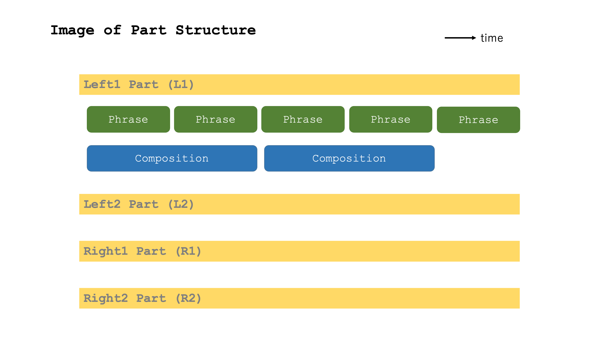
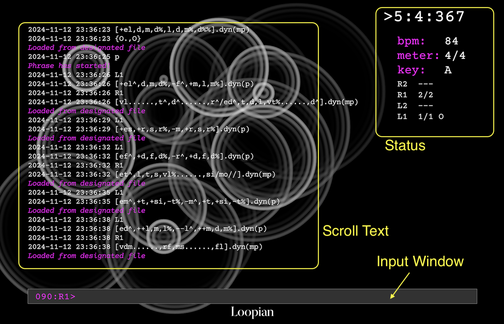
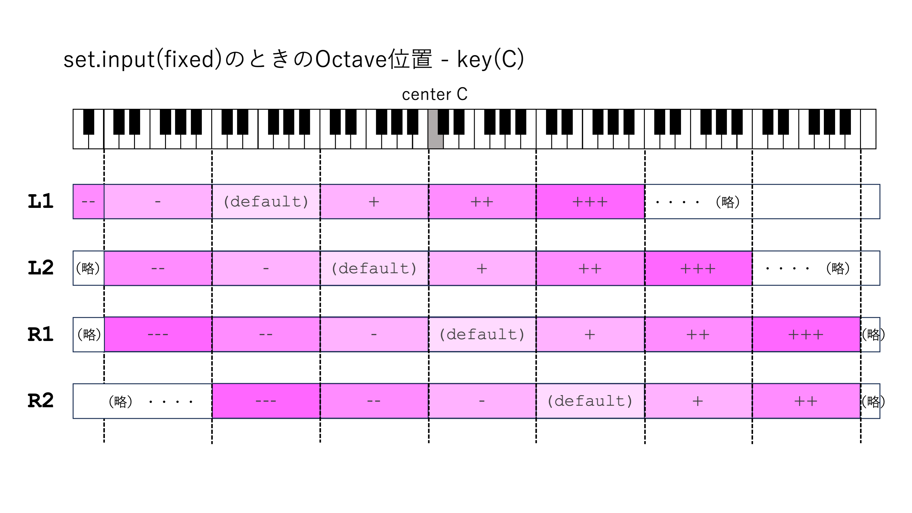
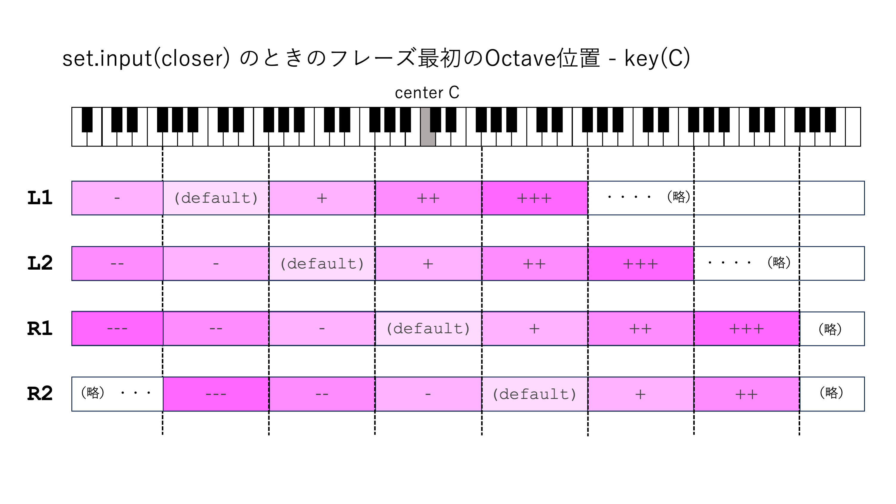

# Loopian Reference Manual

[English Version is here](manual_en.md)

## 目次

- [Loopian とは](#loopianとは)
- [用語集](#用語集)
- [起動と終了](#起動と終了)
    - [起動方法](#起動方法)
    - [コマンド入力](#コマンド入力)
    - [画面表示](#画面表示)
    - [終了](#終了)
    - [音を出すための環境](#音を出すための環境)
- [基本操作コマンド](#基本操作コマンド)
    - [再生コントロール](#再生コントロール)
    - [パートの切り替えとオクターブ動作](#パートの切り替えとオクターブ動作)
- [テンポ、拍子、調などの設定](#テンポ-拍子-調などの設定)
- [Phrase 指定](#phrase-指定)
    - [基本書式](#基本書式)
    - [音程の指定方法](#音程の指定方法)
    - [音価の指定](#音価の指定)
    - [noteの音量とアーティキュレーション指定](#noteの音量とアーティキュレーション指定)
    - [Phraseに後続する関数表記](#phraseに後続する関数表記)
    - [Dynamic Pattern](#dynamic-pattern)
    - [複数Phrase追加入力機能](#複数phrase追加入力機能)
- [Composition 指定](#composition-指定)
    - [Composition基本書式](#composition基本書式)
    - [コード持続時間の指定方法](#コード持続時間の指定方法)
    - [コードの根音(root)指定方法](#コードの根音-root-指定方法)
    - [コード記述方法](#コード記述方法)
    - [コード・スケールの種類](#コードスケールの種類)
- [Part/Compositionの共通仕様、及びその連携](#partcompositionの共通仕様-及びその連携)
    - [Part指定書法](#part指定書法)
    - [Phraseのparallel指定](#phraseのparallel指定)
    - [Variation機能](#variation機能)
- [ファイルのロード、セーブ](#ファイルのロード-セーブ)
    - [ログファイルのセーブ](#ログファイルのセーブ)
    - [ファイルのロード](#ファイルのロード)
    - [ファイルに記述できる特殊記法](#ファイルに記述できる特殊記法)
    - [ロードのオプション機能](#ロードのオプション機能)
    - [ファイル変換](#ファイル変換)
- [再生コントロールの拡張仕様](#再生コントロールの拡張仕様)
- [Graphic](#graphic)
- [setting.tomlの記述](#settingtomlの記述)
- [Loopian::ORBIT での演奏](#loopianorbit-での演奏)
- [usecase](#usecase)
    - [データ再生方法](#データ再生方法)
    - [データの打ち込み方法](#データの打ち込み方法)
- [アプリの内部で自動的に行われること](#アプリの内部で自動的に行われること)

## Loopianとは

Loopian は、Live Coding などで使うために開発している、テキスト入力によるピアノ音色用シーケンサです。
以下の特徴があります
- テキストをInput Windowsに1行単位で入力し、その中でフレーズや和音を指定したり、演奏全体をコントロールするコマンドを指定
- ある程度自然な演奏になるように、ベロシティや和音変換時の音程、ダンパーペダルを自動算出
- フレーズは移動ドにて指定

本ドキュメントでは、Loopianの全機能について説明します。

## 用語集

- 階名 : 移動ドによる音程呼称。ドレミファソラシ(`drmfslt`)が示す音は、調によって移動する。
- phrase : メロディや和音など、時系列の音符情報
- composition : phrase に適用して音を変化させる Chord/Scale 情報
- loop : loopian は基本的に、phrase/composition を繰り返す。この繰り返し単位。
- part : phrase/composition はそれぞれ独立した４つの Loop 再生が可能である。そのphraseとcompositionがセットになったものを part と呼ぶ。



## 起動と終了

### 起動方法

1. ターミナルを開く
2. Loopian のフォルダに移動
```
cd /path/to/loopian
```
3. アプリを起動
```
./loopian
```
4. オプション付きで起動する場合:
- サーバーモード: `./loopian --server`

5. コンパイラから起動する場合:
- Raspberry Pi 5 用: `cargo build --features raspi`
- 詳細ログ付き: `cargo build --features verbose`


### コマンド入力



- アプリを立ち上げると、画面下の Input Window に下記のような入力用プロンプトが表示される
    - `NNN: L1>` : 入力用プロンプト
- NNN: は入力したコマンド履歴の現在の位置を表している
    - 999:を超えると表示は000:になるが、以前の履歴も覚えている
- L1> は Left 1 の入力状態であることを示す
- このプロンプトの後のカーソルの位置に、コマンドやフレーズを入力し、Return で確定する
- 左右矢印キーで、入力中のカーソルを移動できる
- 上下矢印キーで、過去入力の履歴呼び出しが可能
    - カーソルの誤操作防止のため、入力カーソルが左端にないときは履歴呼び出しは出来ない
- Loopian では、space の入力は `.`（ピリオド）に変換される

### 画面表示

- Input Window で入力した文字列は、Return で確定後、Scroll Text の最下行に追加される
- Scroll Text に追加したテキストは、表示行数を超えるとスクロールする
- 画面上部の Status Indicator には、以下の情報が表示される:
    - `>M:B:TTT`：再生中を示し、小節数(M)、拍(B)、拍内の tick(TTT)を表示
    - `bpm:BBB`：現在のテンポを表示
    - `meter:N/D`：現在の拍子を表示
    - `key:N`：現在の調を表示
    - `R2 ---` : は、各パートの再生位置(ループ内の位置/ループ全体の小節数)、および和音情報を表示
        - ループ内の位置が `-1` の場合、次の新しい Phrase が予約されていることを示す

### 終了

- `!quit` or `!q` をInput Windowに入力し、returnするとアプリが終了
- ウインドウの close ボタンを押しても終了
    - ただし、ログファイルは記録されない


### 音を出すための環境

- Loopian はMIDI出力のみなので、別途音源が必要
- PC内のMIDI音源や、外部MIDI音源を選択でき、Loopian と同じフォルダにある setting.toml にて設定する。
    - setting.toml の [midi] midi_out を接続先の名前に変更してから Loopian を立ち上げる(後述)
    - 動作確認済みのPC音源
        - Mac では以下のアプリで動作確認済
            - Garage Band / Logic : Mac で MIDI 演奏するための DAW by Apple
            - Pianoteq8 : 物理エンジンベースのPiano音源 by MODARTT
        - Windows では、Microsoft GS Wavetable Synth で動作確認済
- 専用MIDI Controller(Loopian::ORBITなど)を接続し、リアルタイム演奏も可能


## 基本操作コマンド

### 再生コントロール

* `play` or `p` : シーケンス開始(1小節目から)
* `fermata` : 次の小節の頭の拍を再生してbeatを止める
* `resume` : beatが止まっているとき、その小節の先頭から再生を再開する
* `fine` : 現在の小節が終わったらシーケンス終了
* `stop` : 直ちにシーケンス終了
* `panic` : 今鳴っている音を消音する


### パートの切り替えとオクターブ動作

* `left1` or `L1` : 入力パートをleft1 にする
* `left2` or `L2` : 入力パートをleft2 にする
* `right1` or `R1` : 入力パートをright1 にする
* `right2` or `R2` : 入力パートをright2 にする
* 下図に各パートのオクターブ指定方法を示す






## テンポ、拍子、調などの設定

- `set.bpm(100)` : BPM（テンポ）=100 にセット
- `set.meter(4/4)` : 拍子を 4/4 にセット
- `set.key(C4)` : key を C4 にセット
    - loopian にとって key とは `[d]`（ド） と指示されたときの音名を表す
    - デフォルト値は C4(midi note number=60)
    - 音名は C-B と大文字で表現し、必要に応じて前に #, b を足すことができる
    - 音名の後ろの数値はオクターブを指示するが、省略可能
        - 省略した場合、今設定されているオクターブがそのまま適用される
- `set.oct(+1)` : 現状から１オクターブ上げる
    - `oct(0)` : 0は、現状の値を無視し、初期値に戻す
- `set.msr(5)` : 次に `resume` を入力したとき、5小節目から開始する
- `set.input(fixed)` : 階名を入力したときのオクターブ決定法
    - `fixed` は、入力する階名は絶対位置(d-tまでを同じオクターブ内とする)
    - `closer` は、+-指示がない限り、前回に近い音程(-5..6) (default)
- `set.samenote(modeling)` : 同音連打の動き方
    - `modeling` は、モデリング音源向けで、note off は一度しか送らない（default）
    - `common` は、一般的なMIDI音源向けで、note off は note on の数だけ送られる
- `set.turnnote(5)` : para 指定時、変換後の音程を折り返す位置(0-11, default=5)
- `set.path(name)` : load の下にある読み込みたいディレクトリ名を指定


## Phrase 指定

### 基本書式
- `[note].fn1().fn2()` : phrase 入力の書式
- *note*: 音符ごとの階名、音価表現、音量情報を入力する
    - この中に書かれた音符が LOOP 再生される
- *fn*: 関数（音符変調関数、音楽表現関数）
    - 関数は省略可能
    - 関数は、`.` で繋げて、複数の関数を追記可能
- `[]` : 全データ削除
- `[.....//]` : 最後に // が二つあった場合は LOOP せず、Phrase の再生が止まる
    - 後述する variation には適用されない

### 音程の指定方法
- 音程は移動ドで表現
    - iをつけると半音高くなる
    - aをつけると半音低くなる

|階名|ド|レ|ミ|ファ|ソ|ラ|シ|
|-|-|-|-|-|-|-|-|
|表記|d|r|m|f|s|l|t|
|半音上|di|ri|mi|fi|si|li|ti|
|半音下|da|ra|ma|fa|sa|la|ta|

- ある音程のオクターブを設定する際、相対オクターブと絶対オクターブの二つの考え方がある
    - 相対オクターブ指定(input(closer))では、上下の近い方に行く場合何も表記しない。近くない場合、以下のように指定する
        - `-d` : （近くない）下の方のド
        - `+d` : （近くない）上の方のド
        - `--d`: 二つ下
        - `++d`: 二つ上
    - 絶対オクターブ指定(input(fixed))の場合、`d-t`までが同じオクターブに含まれ、そのパートのデフォルトのオクターブ内なら何も表記しない
        - デフォルトより上のオクターブは `+` を音程の前に付ける
        - 同様に下のオクターブは、`-` を音程の前に付ける
    - 相対か絶対かは `set.input` で変更できる(デフォルトはinput(closer))

- 音の繋ぎ方
    - `x` : 休符
    - `,` : 各音の区切り。１小節を超えたら捨てられる。区切りが連続すると休符が省略されたとみなす
    - `|` or `/` : 小節区切り。区切りが連続すると休符が省略されたとみなす
    - `dms` : 同時演奏 (各音を連続して書く)
        - 左側から低い順に音程を記述する
        - `+` をつけた場合、+が無い場合の音の１オクターブ上の音になる
        - `[i,jkl,m]` と書いた場合、前の音との相対距離は i->j で考え、後ろの音との相対距離は l->m で考え、j,m の前に `+,-` を付けるか判断する。 
    - `d*4` : ドを４回連続して発音


### 音価の指定
- 何も音価表現しないで階名を入力したときに採用される音価のことを**基準音価**と呼ぶ
    - デフォルトの基準音価は四分音符
    - 新しい音価を書けば、この指定が基準音価となり、次に音価を書かない限りこの音価が継続する
- `h`二分音符 (例:`[hd,r/m,f]`)
- `q`四分音符 (例:`[qd,r,hm/qf,s,l,t]`)
- `e`:八分音符 (例: `[em,r,d,r,qm,r]`)
- `v`:十六分音符 (例: `[em,vr,d,et,vd,r,em,vr,d,t,d,r,d]`)
- `w`:三十二分音符
- `[3ed,r,m]` : 'の前に3を書くと、一拍三連の音価になる
    - 同様に、5連符が可能
    - 同様に、3q で二拍三連
- `[h'd]` `[q'd]` : 'の前にhを書くと付点二分音符、qを書くと付点四分音符
- `do/` : ドをその小節の終わりまで伸ばす（oから|までの間の文字は無視される） 
- `d..` : ドを基準音価の３倍（もう２回）伸ばす 
    - `d./..` のように小節を跨ぐこともできる（タイ）
    - `do/o/` は２小節伸ばす
- `hd_e` : 二分音符と八分音符をタイで結ぶ
    - `qd/_e` のように小節を跨ぐこともできる（タイ）
    - 基準音価は、タイで繋いだ後ろの音符の音価に移る
- `[$hdrm]` : 音価より前に `$` があり、同時に演奏する音符がある場合、アルペジオ演奏を行う。
- 弱起表現機能
    - `[An:.....]` のように冒頭にAと任意の拍を表す数値を記載すると、その拍から始まる弱起のフレーズを書くことができる
    - `[A3:d,r/m,f,s,t/d]` : 二拍休んで、三拍目からその後のフレーズが始まる
    - 弱起の小節は前のフレーズの最後の小節と重なって演奏される
    - **<注意!>** 弱起のフレーズの次のフレーズは、最後の１小節になってから入力すると、弱起のフレーズが始まってしまうので、それより前に入力するか、弱起のフレーズに `//` を入れ、繰り返さないようにするなど注意が必要


### noteの音量とアーティキュレーション指定
- `d^` : 階名の後ろに `^` をつけると音量が大きくなる。複数個つけることも可能
- `d%` : 階名の後ろに `%` をつけると音量が小さくなる。複数個つけることも可能
- `d!` : 最後に `!` をつけると音の長さが音価の半分になる。(stacc(),legato()より強い)
- `d~` : 最後に `~` をつけると音の長さが音価の120%になる。(stacc(),legato()より強い)
- `<d,r,m>!`: 複数のNoteを`<>!`で囲むと、それらの音の長さが音価の半分になる
- `<d,r,m>~`: 複数のNoteを`<>~`で囲むと、それらの音の長さが音価の120%になる


### Phraseに後続する関数表記
- Phrase を記述した `[]` の後に、`.fn()` と指定することで、Phrase 全体への指示を行うことができる
- 音符の表記そのものに何らかの変更を行う音符変調関数と、Phrase 全体に効果をかける音楽表現関数の二種類がある
- **音符変調関数**(note modulation function)
    - `rpt(n)` :n=繰り返し回数、2ならそれ自身を含め合計3回繰り返し
- **音楽表現関数**(musical expression function)
    - `dyn(f)` : f,mf,mp,p,pp を引数に入れ、フレーズの音量指定
    - `dmp(on)` `dmp(off)` : off: 和音指定時でも Pedal Off指定
    - `stacc(50)` : 音価を半分にする（1-100まで調整可能）
    - `legato(120)` : 音価を20%増やす（100-200まで調整可能）
    - `trns(para)` or `para()` : 和音変換時、parallel 指定する。（全フレーズの parallel と同じ）
    - `asMin()` or `as(VI)` : parallel 指定の時、Phrase を VI のスケールとみなし、VI からの差分で並行移動する


### Dynamic-Pattern
- Dynamic Pattern は、Phrase の中で実際の音程を指示せず、同時和音や分散和音を自動生成する
- 同時に鳴る和音は `Cls()` (Cluster)、分散和音は `Arp()` (Arpeggio)と記述する
    - `C(), A()` と小文字を省略可能
    - `[hCls(),hArp()]` のように、Phrase の中に記載し、前に Pattern 全体の音価を示す
- `Cls(a,b,c)` とカッコ内をカンマで区切って、パラメータを与えることができる
    - パラメータは最大で3つで、４つ以上与えた場合以降は無視される
    - パラメータが足りない場合は、default値が適用される
    - a（一つ目のパラメータ）: 音価を表す。h,q,e,v,w およびその三連、五連、付点を選ぶことができる(default:q)
    - b（二つ目のパラメータ）: 和音の音数(2-5)(default:4)
    - c（三つ目のパラメータ）: 最低音の位置(-6 - 7)(default:0)
    - `$C()` のように `C` の前に`$`がある場合、同時和音に対するアルペジオ演奏を行う
        - `$SC` ゆっくりなアルペジオ(Slow)
        - `$QC` 速いアルペジオ(Quick)
        - `Arp()` と名前が被っているが、`$` は記譜上のアルペジオ記号のことを指している
- `Arp(a,b,c)` とあった場合、各パラメータは以下の意味になる
    - a: 音価を表す。h,q,e,v,w およびその三連、五連、付点を選ぶことができる(default:q)
    - b: u は上昇音形、dは下降、uxはクロス上昇、dxはクロス下降
    - c: 最低音の位置(-6 - 7)(default:0)
- Phrase と同じ関数を後ろに追加することが可能
- 基本的には小節をまたがない


### cluster_memory機能
- 一拍分の音符を、Phraseに使うために事前に登録することができる
- `@c=dms` : ドミソの和音を同時に発音する
- `[ec,x,x,c,c,x,x,c]` : 前に設定した和音を c のタイミングで発音する

### 複数Phrase追加入力機能
- `[...]+` と Phrase にプラスを書いた後に return しても再生されず、次回の Phrase の入力を待つ状態になる
    - `[aaa]+` の後に `[bbb]` を入力したら、`[aaabbb]` と同じ入力がされたとみなし、再生データが生成される
    - 単純に二つの文字列が足されるため、`[a,b,c,]+` というように、`c` の後ろにも `,` や `/` が必要となる。
- `[ax].rpt(2)+` というように、rpt()+ を後ろに入力したら `[axaxax]` と同じ入力がされたとみなす
    - `L1.[...]+` のように、パート指定と同時に使った場合はエラーとなる


## Composition 指定

### Composition基本書式
- `{chord}` : Composition の書式
    - *chord*: コードを拍、小節ごとに区切って時系列で記述
        - この中に書かれたコードが LOOP 再生される
    - `{}` : 全データ削除
    - `{.....//}` : 最後に // が二つあった場合は LOOP せず、Composition の再生が止まる

### コード持続時間の指定方法
- `|` or `/` : 小節区切り。区切りが連続するとコードがないとみなす
- `{I/IV/V}` : １小節ごとに I -> IV -> V とコードが変わる
    - `/./` 小節線の間にピリオドを入れると、前の小節と同じコードになる
- 同小節内でコードを変える場合、拍ごとに`,`で区切る。
    - 複数拍を同じコードにしたい場合、`.` で伸ばす
    - `,,` のように何も記さずにカンマを続けた場合、その拍にコードがないとみなす
- コード情報とピアノの Pedal 情報はリンクしている
    - コードが変わるごとにペダルは踏み直される
    - 小節が変わるごとにペダルは踏み直される

### コードの根音(root)指定方法

|主音からの距離|一度|二度|三度|四度|五度|六度|七度|
|-|-|-|-|-|-|-|-|
|根音の表記|I|II|III|IV|V|VI|VII|

### コード記述方法
- `X` : original phrase(no pedal)
- `O` : original phrase(pedal)
- `I` : `dms` (Iの和音)
- `I#` : `dimisi` (数字の後に # を付けると半音高いコードになる。b は半音)
- `Iion` : Iを主音としたイオニアンスケール(Ionian)
    - `_ion, _dor, _lyd, _mix, _aeo` という教会旋法を指定した場合、通常のコードとは動作が違っている
    - `Iion, IIdor, IVlyd, Vmix, VIaeo` がその調のダイアトニックスケールになり、それ以外の root が指定された場合、その差分分だけ並行移動する。
- `lydian` : 現在のkeyを主音としたリディアンスケール
- `!` をコードの最後に追加すると、当てはまる音が等距離の場合、上側を採用する（通常は下側を採用）
- コードやスケールが判断不能の場合、エラーとなり調の主音しか出ない

### コード・スケールの種類
- 読み方
    - アンダーバー`_`には root(I-VII) が入る
    - 構成音ではrootから順に対象音`o`か、非対象音`x`かを示す

- 基本和音
    |和音名|和音の表記|和音の構成音|
    |-|-|-|
    |長三和音|_|`oxxx-oxxo-xxxx`|
    |短三和音|_m|`oxxo-xxxo-xxxx`|
    |属七和音|_7|`oxxx-oxxo-xxox`|
    |六の和音|_6|`oxxx-oxxo-xoxx`|
    |短七和音|_m7|`oxxo-xxxo-xxox`|
    |長七和音|_M7,_maj7|`oxxx-oxxo-xxxo`|
    |長七+短三和音|_mM7|`oxxo-xxxo-xxxo`|

- テンション和音
    |和音名|和音の表記|和音の構成音|
    |-|-|-|
    |add9th|_add9|`oxox-oxxo-xxxx`|
    |属九和音|_9|`oxox-oxxo-xxox`|
    |長九+短七和音|_m9|`oxxo-xxxo-xxox`|
    |長九和音|_M9,_maj9|`oxox-oxxo-xxxo`|
    |長九長七+短三和音|_mM9|`oxoo-xxxo-xxxo`|
    |増三和音|_+5,_aug|`oxxx-oxxx-oxxx`|
    |増三長七和音|_7+5,_aug7|`oxxx-oxxx-oxox`|
    |短九+属七和音|_7-9|`ooxx-oxxo-xxox`|
    |増九+属七和音|_7+9|`oxxo-oxxo-xxox`|
    |減七和音|_dim|`oxxo-xxox-xxxx`|
    |導七和音|_m7-5|`oxxo-xxox-xxox`|
    |suspended4th|_sus4|`oxxx-xoxo-xxxx`|
    |属七+suspended4th|_7sus4|`oxxx-xoxo-xxox`|
    |全半音|_chr|`oooo-oooo-oooo`|

- 教会旋法
    |和音名|和音の表記|和音の構成音|
    |-|-|-|
    |イオニア|_ion|`oxox-ooxo-xoxo`|
    |ドリアン|_dor|`oxoo-xoxo-xoxo`|
    |リディアン|_lyd|`oxox-oxoo-xoxo`|
    |ミクソリディアン|_mix|`oxox-ooxo-xoox`|
    |エオリアン|_aeo|`oxoo-xoxo-oxox`|
    |ダイアトニック(rootなし)|diatonic|`oxox-ooxo-xoxo`|
    |ドリアン(rootなし)|dorian|`oxoo-xoxo-xoxo`|
    |リディアン(rootなし)|lydian|`oxox-oxoo-xoxo`|
    |ミクソリディアン(rootなし)|mixolydian|`oxox-ooxo-xoox`|
    |エオリア(rootなし)|aeolian|`oxoo-xoxo-oxox`|
    |コンディミ(rootなし)|comdim|`oxoo-xoox-ooxo`|
    |ペンタトニック(rootなし)|pentatonic|`oxox-oxxo-xoxx`|
    |ブルース(rootなし)|blues|`oxxo-xooo-xxox`|
    |スルー(rootなし)|O|`oooo-oooo-oooo`|
    |スルー、pedal無し(rootなし)|X|`oooo-oooo-oooo`| 

## Part/Compositionの共通仕様、及びその連携

### Part指定書法
- Phrase / Composition ともに、冒頭でパート指定することで、プロンプトのパートと違うパートも入力することができる
    - `L1.[...]`  : left1パート
    - `L12.[...]` : left1,left2パート二つ同時に同じ Phrase をセット
    - `ALL.[...]` : 全パートに同じ Phrase をセット
    - `L1!.[...]` : left1パート以外全て

### Phraseのparallel指定
- 和音変換時、root に合わせて Phrase が並行移動する
- `{IV}` の場合だと、Phase 全体が完全四度移動した上で、和音構成音への変換が行われる
- note単位の和音変換指定が可能
    - `[>d,s,d,m,d,>>s]` : `>` はparallel動作、 `>>` は変換しない
    - 複数音を parallel 指定する場合、`<...>p` と複数音を `< >p` で囲む
        - `[<d,m,s,d,s,m>p]` : 全フレーズが parallel
        - `[<d,s>p,m,d,s,m]` : 最初の d,s の2音が parallel
    - 複数音を無変換にしたい場合、`<...>n` とする

### Variation機能
- Variation 機能とは、一つのパートに複数の Phrase を入力し、それらの再生順を Composition で指定したり、特定の小節で再生することができる機能である
    - これにより Loop 内で、定期的に異なる Phrase を再生することができる
- `@n=[..]` : Phrase 指定の冒頭に @n(nは1から9までの数値)を付け足すことで、Variation を追加できる
- 追加された Variation Phrase は、Composition で以下のように指定する
    - `{I/II@n}` Chord指定の後に `@n`(n:1-9) と書くと、この小節冒頭から Variation Phrase が再生される
    - chord指定せずに直接 `@n` のみを書いた場合、Chord は何も書かなかった時と同じ扱いになる 
    - Composition で指定した場合、前の Phrase が途中でも中断し、Variation Phrase を再生する
    - Phrase より Composition が先に終了しても、Variation Phrase が残っていれば、そのまま再生を続ける
- 特定の小節で再生するとき `@msr(M)=[..]` と表記し、M の部分に小節の条件を記述する
    - M が数字のとき、その小節番号になったら再生される
- Variation Phrase が終了後、新しい Variation 指定がなければ、通常の Phrase が再生される

## ファイルのロード、セーブ

### ログファイルのセーブ

- Loopian を終了すると、自動的にログファイルがセーブされる
    - アプリのあるフォルダに、/log フォルダが自動的に作られ、その中にログファイル（拡張子はlpn）がセーブされる
    - 2023-06-02_19-56-54.lpn というように、日時がファイル名となる
- `!save(n).`*filename* 
    - 任意の履歴番号n行目以降の入力を、指定されたファイル名でセーブすることができる
    - *filename* を省略すると、日時がファイル名になる


### ファイルのロード

- `!load.`*filename* (あるいは `!l.`*filename*) 
    - 指定したファイルをロードする
    - ログファイルと同様の形式のファイルがロードされることを想定している
    - ロードされた内容は、history の中に格納され、カーソル（上下）キーで一行ずつ呼び出すことができる
    - 冒頭が `//` あるいは `20` あるいは `!rd(`のテキストになっている行は、ロードされない
        - `20` は 2024 の西暦を意味し、2024-05-19 のように日付が入った行は再生しないことを意味する
- ファイル指定、パスの設定について
    - 最初のloadコマンド入力時、アプリのあるフォルダに、/load フォルダが自動的に作られる
    - ロードファイルの拡張子は`lpn`のみで、ファイル指定では拡張子を書く必要はない
    - loadしたいファイルは、この /load フォルダ以下に入れておく必要がある
        - サブフォルダを作ることも可能
        - その場合ロード前に `set.path(xxx)` でサブフォルダ名を指定する
    - `!load` のみの入力でも、前回のファイル名を覚えており、前回と同じファイルがロードされる。


### ファイルに記述できる特殊記法

- `!msr(n)` とファイル内に書かれた行以降は、n小節の1拍目に間に合うように再生される
    - 実際には、n-1小節目の残り240tickを切ったところで再生される
    - load 中に wait があり、自動 load 中と見做される場合でも、ユーザーによるInput Windowへの入力は可能である
- `!rd(n): xxxx` とファイル内に記載されている場合、ファイルを読み込んだ後 `!rd(n)` をInput Windowに入力すると、ファイル内の同じ行のそれ以降の文字列 `xxxx` が自動に入力される（nは任意の数字）

### ロードのオプション機能

- `!load.`*filename*`.blk(a)`
    - ファイル内の行の冒頭が `!blk(a)` とある行から次の空白行まで再生される。
    - `!blk()` で呼ばれる記述内に `!msr()` があったら無視する
    - 一度 file がロードされていれば、`!load.blk(a)` というように、真ん中のファイル名を省略することも可能
- `!load.`*filename*`.msr(n)`
    - 入力後 `resume` とコマンドを打つと、ファイル内の行の冒頭が `!msr(n)` とある行から再生する
        - 途中再生の場合 `play` ではなく、 `resume` を使用する
    - `!load.msr(n)` というように、真ん中のファイル名を省略することも可能
    - ファイルの記述が Loop 前提の場合など、いくつかの条件では途中の小節からの正確な再生は保証しない。

### ファイル変換

- パート分割処法から継時書法への変換機能
    - `!cnv2tl.`*filename* で、`ファイル名+tl.lpn` というファイル名に変換の上、保存される
    - [データの打ち込み方法](#データの打ち込み方法)参照のこと

## 再生コントロールの拡張仕様

* `rit.` : テンポをだんだん遅くして、次の小節の頭で元のテンポ
    - `rit.poco` : 遅さが弱い
    - `rit.molto` : 遅さが強い 
    - `rit.fermata`  : rit.の次の小節の頭の拍を再生して停止
        - そのまま演奏終了ならば `fine` 再開するなら `resume` を指定する
    - `rit.molto.fermata`
    - `rit.bpm(120)`   : rit.の次の小節をテンポ120で開始
    - `rit.bar(2)` : 2小節rit.をつける
        - `rit.poco.bar(2)`
        - `rit.poco.bar(2).bpm(100)`
        - bar(N) の N は任意の数値
* `sync` : 次の小節の頭で、そのパートの Phrase, Composition を同期させる
    - `sync.right` : 右手パート(right1/2)
    - `sync.left`  : 左手パート(left1/2)
    - `sync.all`   : 全パート
* `clear` : データの中身を消去
    - 引数がない場合、全パート消去し、再生も止まる
    - `clear.L1` : L1パートの中身を消去。同様に L2,R1,R2 も指定可
    - `clear.env` : データではなく key, meter, bpm, oct をデフォルト値に戻す
* `efct` : MIDI Controller の出力
    - `efct.cc70(nn)` : cc70に対して nn(0-127) を送る
    - `efct.dmp(nn)` : cc64のDamperが on になったとき、nn(0-127) を送る


## Graphic

- `graph.light` : 白基調の画面に変化
- `graph.dark`  : 黒基調の画面に変化
- `graph.ripple`: 水紋パターン(default)
- `graph.voice` : 分割された各声部が円で表示されるパターン
- `graph.lissa` : 二つのリサジューを結んだ線を表示するパターン
- `graph.beatlissa(n)` : Beat でリサジュー波形を表示するパターン
    - `n`: 0-一つ、1-拍数
- `graph.sinewave` : 音に合わせたサイン波
- `graph.rain` : 雨が降っている様子を模したパターン
- `graph.fish` : 魚が泳いでいる様子を模したパターン
- shift + space で、以下のように4段階で表示する Text の状況を変化させられる。4の次は1に戻る。
    - 1: 通常の表示。Graphic は文字の後ろのレイヤーとして表示。
    - 2: Scroll Text が少し薄くなる。Graphic は文字の前のレイヤーとして表示。
    - 3: Scroll Text がかなり薄くなり、Input Window が非表示となる。Graphic は文字の前のレイヤー。
    - 4: Graphic Pattern のみになり、Scroll Text と Input Window が非表示となる。Graphic は文字の前のレイヤー。

## setting.tomlの記述
- [window_size] では、アプリを立ち上げた時のデフォルトのウィンドウサイズを設定できる
- [midi] では、Loopian のMIDI環境を設定できる
    - `midi_out =` 以降に、Loopianから出力されるMIDIで発音する音源のdevice名を記載する
    - `midi_ext_out =` 以降は、Loopian::ORBITにMIDIを出力する際、Loopian::ORBITに繋げるMIDI OUT端子を持ったdevice名を記載する
    - `midi_device =` 以降は、Loopian::ORBITからMIDIを入力する際、MIDIを出力するdevice名を記載する
    - 上記device名は、Loopianを立ち上げた際、以下のようにターミナル上に出力される
        - `--MIDI Output List--` と書かれた行の後に、Loopianが出力できるMIDI Deviceが一覧で表示される
        - `--MIDI Input List--` と書かれた行の後に、Loopianに入力できるMIDI Deviceが一覧できる 


## Loopian::ORBIT での演奏

- Loopian::ORBIT からの MIDI 情報は、`FLOW` パートという内部パートが受信し、適切な処理を行う。
    - `FLOW` パートは `FLOW.{...}` のように、パート指定による Composition 入力が可能である。Phrase は入力できない。
    - `FLOW` パート自体を入力パートにすることはできない。
- FLOWパートで再生されている Composition は、USB MIDI 経由で外部出力され、入力側は UART MIDI で受信する。
    - Composition は、AAh-0rh-cch の形式で送信される。
        - AAh : Poly After Touch を MIDI Ch.11 に送信
        - 0rh : root (0-11)
        - cch : CHORD_TABLE[] の index 番号


## usecase

### データ再生方法

- load フォルダ内のデータは以下の手順で再生する
    1. loopianを立ち上げる
    1. `set.path(xxx)` で再生したい曲データのフォルダ名(xxx)を指定
    1. `!l.yyy` で再生したい曲データを指定（yyy.lpnを再生したい場合、yyyのみを指定）
    1. `play` or `p` で再生
    1. 再生を終えたら、`stop` or `.` で再生停止
- 小節途中から再生したいとき
    1. `!l.yyy.msr(M)` で再生したいファイル名(yyy)を指定し、再生したい小節番号(M)を指定
        - 2回目以降は `!l.msr(M)` とファイル名を省略可能
    1. `resume` で再生


### データの打ち込み方法

- 曲データを打ち込む際は、以下の手順で行う
    1. loadフォルダ以下に必要に応じて新しいフォルダを作成し、`xxx.lpn` というテキストファイルを作成
    1. 冒頭に set 系コマンドなど、曲再生に必要な設定を行う
        - 冒頭に clear を書き、その後 meter, key, bpm を設定
        - load前の状態に画面が依存しないように、graph の設定も必要に応じて行う
    1. Variation機能の `@msr(M)=[]` を用い、パートごとに曲データの打ち込みを行う（パート分割書法）
    1. 適宜、コメントアウトして確認に不要なパートをミュートする
    1. 再生は `!l.*filename*.msr(n)` (nは小節番号)を入力後、`resume` で行い、任意の小節番号から再生を行うことで打ち込み内容を確認（filenameは、2回目以降省略可能）
        - `!l`,`set.msr(M)`,`resume` と分割することも可能だが、`!msr(M)` を使用した場合、分割では途中読み込みをしないため、うまく動作しない
    1. 全パート打ち込んだら、パートごとの並びを小節順に並び替え、`!msr(M)=[]` の表記で書き直す（継時処法）
        - パート分割書法を継時処法に自動に書き換える `!cnv2tl` コマンドが利用可能
        - こちらの書法のほうが、再生時の自動ロードで順次ロードされるので、視覚的に楽しめる
    1. テンポ変化などを書き加える
- Phrase 入力の注意事項
    - 小節を跨いだタイを実現するには、現状同じ行に記述するしかない
        - 全曲を１小節一行で書くことができない場合がある


## アプリの内部で自動的に行われること

- 指定されたコードに合わせて、音程を自動変換する
    - 単音の連続する八分音符以下のフレーズは、アルペジオ的奏法とみなし、なるべく同じ音が続かないようにする
- ベロシティ（音の強さ）を、拍やテンポに合わせて変化させている
    - ベロシティをランダムにわずかにずらしている
- noped 指定されない限り、一番細かい和音指定に合わせて、ペダル情報を自動的に算出する
    - 同じコードが続く場合、1小節に一度踏み替える
