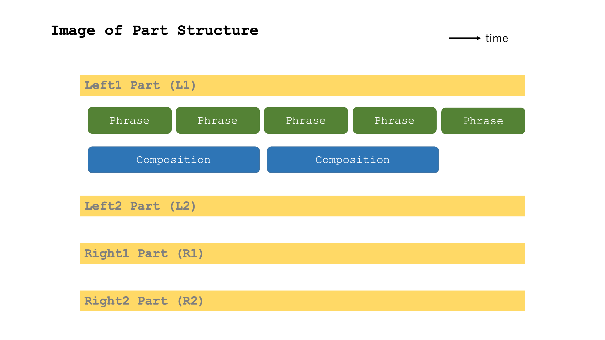
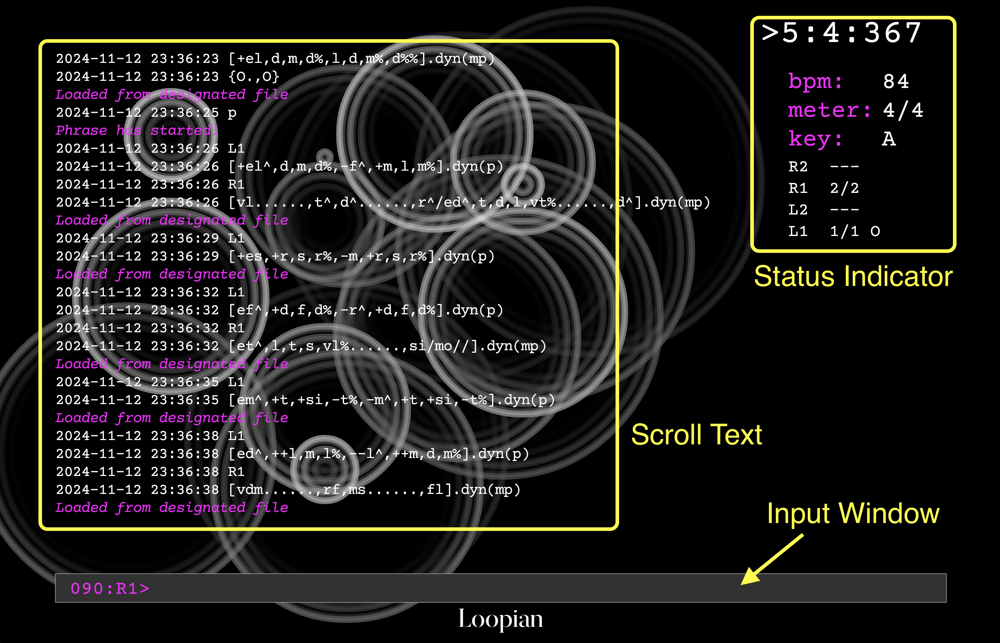
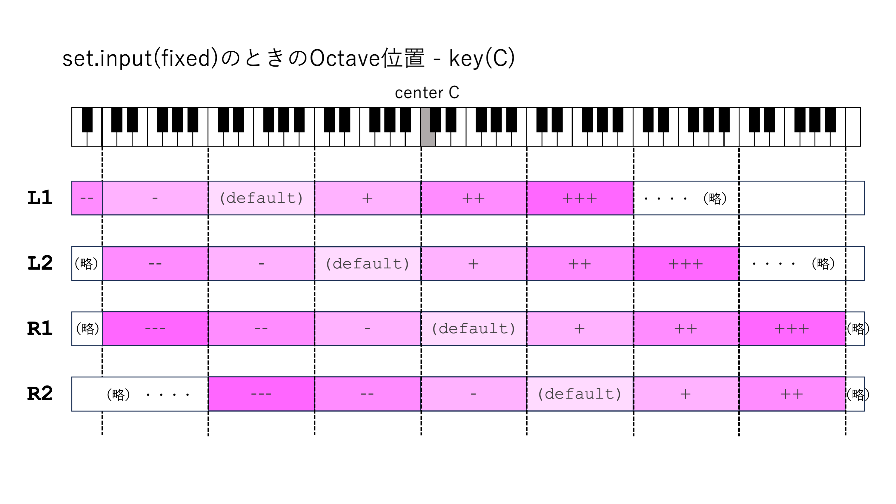

# Loopian Reference Manual

## Table of Contents

- [What is Loopian](#what-is-loopian)
- [Glossary](#glossary)
- [Starting and Exiting](#starting-and-exiting)
    - [How to Start](#how-to-start)
    - [Command Input](#command-input)
    - [Exiting](#exiting)
    - [Environment for Sound Output](#environment-for-sound-output)
- [Basic Operation Commands](#basic-operation-commands)
    - [Playback Control](#playback-control)
    - [Part Switching and Octave Operation](#part-switching-and-octave-operation)
- [Tempo, Time Signature, Key and Other Settings](#tempo-time-signature-key-and-other-settings)
- [Phrase Specification](#phrase-specification)
    - [Basic Format](#basic-format)
    - [Pitch Specification Methods](#pitch-specification-methods)
    - [Note Value Specification](#note-value-specification)
    - [Note Volume and Articulation Specification](#note-volume-and-articulation-specification)
    - [Function Notation Following Phrases](#function-notation-following-phrases)
    - [Dynamic Pattern](#dynamic-pattern)
    - [Multiple Phrase Addition Input Function](#multiple-phrase-addition-input-function)
- [Composition Specification](#composition-specification)
    - [Composition Basic Format](#composition-basic-format)
    - [Chord Duration Specification Methods](#chord-duration-specification-methods)
    - [Chord Root Specification Methods](#chord-root-specification-methods)
    - [Chord Notation Methods](#chord-notation-methods)
    - [Types of Chords and Scales](#types-of-chords-and-scales)
- [Common Specifications for Parts/Compositions and Their Coordination](#common-specifications-for-partscompositions-and-their-coordination)
    - [Part Specification Notation](#part-specification-notation)
    - [Phrase Parallel Specification](#phrase-parallel-specification)
    - [Variation Function](#variation-function)
- [File Loading and Saving](#file-loading-and-saving)
    - [Saving Log Files](#saving-log-files)
    - [Loading Files](#loading-files)
    - [Special Notations in Files](#special-notations-in-files)
    - [Loading Option Functions](#loading-option-functions)
    - [File Conversion](#file-conversion)
- [Extended Playback Control Specifications](#extended-playback-control-specifications)
- [Graphic](#graphic)
- [setting.toml Description](#settingtoml-description)
- [Performance with Loopian::ORBIT](#performance-with-loopianorbit)
- [Use Cases](#use-cases)
    - [Data Playback Methods](#data-playback-methods)
    - [Data Input Methods](#data-input-methods)
- [Automatic Internal Application Processes](#automatic-internal-application-processes)

## What is Loopian

Loopian is a text-input piano sequencer developed for use in Live Coding and similar applications.
It has the following features:
- Text is input line by line in Input Windows to specify phrases and chords, as well as commands to control the overall performance
- Automatically calculates velocity, pitch in chord conversion, and damper pedal for somewhat natural performance
- Phrases are specified using movable-do notation

This document explains all features of Loopian.

## Glossary

- Scale degree: Pitch designation using movable-do system. The pitches indicated by do-re-mi-fa-so-la-ti (`drmfslt`) move according to the key.
- phrase: Time-series note information such as melodies and chords
- composition: Chord/Scale information that modifies sounds when applied to phrases
- loop: Loopian basically repeats phrase/composition. This is the unit of repetition.
- part: Four independent Loop playbacks are possible for phrase/composition. A set of phrase and composition is called a part.

## Starting and Exiting

### How to Start

1. Open terminal
2. Navigate to Loopian folder
`cd /path/to/loopian`

3. Launch application
`./loopian`

4. When launching with options:
- Server mode: `./loopian --server`

5. When launching from compiler:
- For Raspberry Pi 5: `cargo build --features raspi`
- With detailed logs: `cargo build --features verbose`

### Command Input

- When launching the application, an input prompt appears in the Input Window at the bottom of the screen
    - `NNN: L1>` : Input prompt
- NNN: indicates the current position in the command history
    - After exceeding 999:, the display becomes 000:, but previous history is still remembered
- L1> indicates that the input state is Left 1
- Commands and phrases are input at the cursor position after this prompt and confirmed with Return
- Left and right arrow keys move the cursor during input
- Up and down arrow keys can recall past input history
    - To prevent cursor operation errors, history recall is not possible when the input cursor is not at the left edge
- In Loopian, space input is converted to `.` (period)

### Exiting

- Enter `!quit` or `!q` in the Input Window and press return to exit the application
- You can also exit by pressing the window's close button
    - However, log files will not be recorded in this case

### Environment for Sound Output

- Since Loopian only outputs MIDI, a separate sound source is required
- You can select either PC internal MIDI sound sources or external MIDI sound sources, configured in setting.toml located in the same folder as Loopian
    - Change the [midi] midi_out in setting.toml to the name of the desired connection before launching Loopian (described later)
    - Verified PC sound sources:
        - On Mac, verified with the following applications:
            - Garage Band / Logic: DAW for MIDI performance on Mac by Apple
            - Pianoteq8: Physical engine-based Piano sound source by MODARTT
        - On Windows, verified with Microsoft GS Wavetable Synth
- Real-time performance is also possible by connecting a dedicated MIDI Controller (such as Loopian::ORBIT)

## Basic Operation Commands

### Playback Control

* `play` or `p`: Start sequence (from measure 1)
* `fermata`: Play the first beat of the next measure and stop the beat
* `resume`: When the beat is stopped, resume playback from the beginning of that measure
* `fine`: End sequence after current measure completes
* `stop`: End sequence immediately
* `panic`: Silence currently playing notes

### Part Switching and Octave Operation

* `left1` or `L1`: Set input part to left1
* `left2` or `L2`: Set input part to left2
* `right1` or `R1`: Set input part to right1
* `right2` or `R2`: Set input part to right2
* The figure below shows octave specification methods for each part

## Tempo, Time Signature, Key and Other Settings

- `set.bpm(100)`: Set BPM (tempo) to 100
- `set.meter(4/4)`: Set time signature to 4/4
- `set.key(C4)`: Set key to C4
    - For Loopian, key represents the pitch when `[d]` (do) is specified
    - Default value is C4 (midi note number=60)
    - Note names are expressed in capital letters C-B, and can be preceded by # or b as needed
    - The number after the note name indicates the octave but can be omitted
        - When omitted, the currently set octave is applied
- `set.oct(+1)`: Raise one octave from current state
    - `oct(0)`: 0 ignores current value and returns to initial value
- `set.msr(5)`: When `resume` is next input, start from measure 5
- `set.input(fixed)`: Method for determining octave when inputting scale degrees
    - `fixed`: Input scale degrees are absolute positions (d-t within same octave)
    - `closer`: Without +- indication, uses pitch close to previous note (-5..6) (default)
- `set.samenote(modeling)`: Behavior for repeated notes
    - `modeling`: For modeling sound sources, note off is sent only once (default)
    - `common`: For general MIDI sound sources, note off is sent as many times as note on
- `set.turnnote(5)`: Position to fold converted pitch in para specification (0-11, default=5)
- `set.path(name)`: Specify directory name under load to read from

## Phrase Specification

### Basic Format
- `[note].fn1().fn2()`: Phrase input format
- *note*: Input scale degree, note value expression, and volume information for each note
    - Notes written here are played in loop
- *fn*: Functions (note modulation functions, musical expression functions)
    - Functions are optional
    - Multiple functions can be appended, connected by `.`
- `[]`: Delete all data
- `[.....//]`: When // appears at the end, the Phrase stops playing without looping
    - Does not apply to variations described later

### Pitch Specification Methods
- Pitches are expressed in movable-do notation
    - Adding i raises by a semitone
    - Adding a lowers by a semitone

|Scale Degree|Do|Re|Mi|Fa|So|La|Ti|
|-|-|-|-|-|-|-|-|
|Notation|d|r|m|f|s|l|t|
|Semitone up|di|ri|mi|fi|si|li|ti|
|Semitone down|da|ra|ma|fa|sa|la|ta|

- When setting the octave of a pitch, there are two approaches: relative octave and absolute octave
    - In relative octave specification (input(closer)), if going to the nearest up/down, nothing is written. If not nearby, specify as follows:
        - `-d`: (Not nearby) lower Do
        - `+d`: (Not nearby) upper Do
        - `--d`: Two octaves down
        - `++d`: Two octaves up
    - In absolute octave specification (input(fixed)), `d-t` are included in the same octave, and nothing is written if within the part's default octave
        - Add `+` before the pitch for octaves above default
        - Similarly, add `-` before the pitch for octaves below default
    - Relative or absolute can be changed with `set.input` (default is input(closer))

- Note connections
    - `x`: Rest
    - `,`: Note separator. Content exceeding one measure is discarded. Consecutive separators are treated as omitted rests
    - `|` or `/`: Measure separator. Consecutive separators are treated as omitted rests
    - `dms`: Simultaneous playback (write notes consecutively)
        - Write pitches in order from lowest to highest
        - When adding `+`, the note becomes one octave higher than without `+`
        - When written as `[i,jkl,m]`, the relative distance from previous note is considered for i->j, and from subsequent note for l->m, to determine whether to add `+,-` before j,m
    - `d*4`: Play Do four times consecutively

### Note Value Specification
- The note value adopted when entering a scale degree without any note value expression is called the **reference note value**
    - Default reference note value is quarter note
    - When writing a new note value, this specification becomes the reference note value and continues until another note value is written
- `h` half note (example: `[hd,r/m,f]`)
- `q` quarter note (example: `[qd,r,hm/qf,s,l,t]`)
- `e` eighth note (example: `[em,r,d,r,qm,r]`)
- `v` sixteenth note (example: `[em,vr,d,et,vd,r,em,vr,d,t,d,r,d]`)
- `w` thirty-second note
- `[3ed,r,m]`: Writing 3 before ' creates triplet note value
    - Similarly, quintuplets are possible
    - Similarly, 3q for two-beat triplet
- `[h'd]` `[q'd]`: Writing h before ' creates dotted half note, q creates dotted quarter note
- `do/`: Extend Do until the end of that measure (characters between o and | are ignored)
- `d..`: Extend Do three times the reference note value (two more times)
    - Can cross measures like `d./..` (tie)
    - `do/o/` extends for 2 measures
- `hd_e`: Tie half note and eighth note
    - Can cross measures like `qd/_e` (tie)
    - Reference note value changes to the note value of the note after the tie
- Anacrusis expression function
    - Writing `[An:....]` at the beginning with n representing any beat allows writing phrases that start from that beat as anacrusis
    - `[A3:d,r/m,f,s,t/d]`: Rest for two beats, then the phrase starts from the third beat
    - The anacrusis measure overlaps with the last measure of the previous phrase
    - **<Note!>** For phrases following an anacrusis phrase, care must be taken as the anacrusis phrase will start if input is made after the last measure. Input should be made earlier or use `//` with the anacrusis phrase to prevent repetition

### Note Volume and Articulation Specification
- `d^`: Adding `^` after a scale degree increases volume. Multiple can be added
- `d%`: Adding `%` after a scale degree decreases volume. Multiple can be added
- `d!`: Adding `!` at the end makes the note length half of the note value (stronger than stacc(),legato())
- `d~`: Adding `~` at the end makes the note length 120% of the note value (stronger than stacc(),legato())
- `<d,r,m>!`: Enclosing multiple Notes in `<>!` makes their lengths half of the note value
- `<d,r,m>~`: Enclosing multiple Notes in `<>~` makes their lengths 120% of the note value

### Function Notation Following Phrases
- By specifying `.fn()` after the `[]` containing the Phrase, you can give instructions for the entire Phrase
- There are two types: note modulation functions that modify the note notation itself, and musical expression functions that apply effects to the entire Phrase
- **Note modulation functions**
    - `rpt(n)`: n=repeat count, if 2 then repeats total 3 times including itself
- **Musical expression functions**
    - `dyn(f)`: Specify phrase volume with arguments f,mf,mp,p,pp
    - `dmp(on)` `dmp(off)`: off: Specify Pedal Off even during chord specification
    - `stacc(50)`: Halve note value (adjustable from 1-100)
    - `legato(120)`: Increase note value by 20% (adjustable from 100-200)
    - `trns(para)` or `para()`: Specify parallel during chord conversion (same as parallel for all phrases)
    - `asMin()` or `as(VI)`: When parallel is specified, treat Phrase as VI scale and move in parallel based on difference from VI

### Dynamic Pattern
- Dynamic Pattern automatically generates chord or arpeggio playback without specifying actual pitches in the Phrase
- Multiple simultaneous notes (Cluster) are written as `Cls()`, and Arpeggio as `Arp()`
    - Can omit lowercase letters: `C(), A()`
    - Write in Phrase like `[hCls(),hArp()]`, showing overall note value before Pattern
- For `Cls(a,b,c)`, parameters mean:
    - a: Note value. Can choose h,q,e,v,w and their dots (default:q)
    - b: Number of chord notes (2-5)(default:4)
    - c: Position of lowest note (-6 - 7)(default:0)
- For `Arp(a,b,c)`, parameters mean:
    - a: Note value. Can choose h,q,e,v,w and their dots (default:q)
    - b: u for ascending pattern, d for descending, ux for cross ascending, dx for cross descending
    - c: Position of lowest note (-6 - 7)(default:0)
- Can add same functions as Phrase at the end
- Basically doesn't cross measures

### Cluster Memory Function
- You can pre-register one beat's worth of notes to use in Phrases
- `@c=dms`: Play do-mi-so chord simultaneously
- `[ec,x,x,c,c,x,x,c]`: Play previously set chord at timing c

### Multiple Phrase Addition Input Function
- When writing `[...]+` after a Phrase and pressing return, it won't play but will wait for next Phrase input
    - After `[aaa]+`, inputting `[bbb]` will be treated as `[aaabbb]` and generate playback data
    - Since strings are simply concatenated, you need `,` or `/` after `c` in cases like `[a,b,c,]+`
- If you input rpt()+ at the end like `[ax].rpt(2)+`, it will be treated as `[axaxax]`
    - Will result in error if used with part specification like `L1.[...]+`

## Composition Specification

### Composition Basic Format
- `{chord}`: Composition format
    - *chord*: Write chords in time series, separated by beats and measures
        - Chords written here are played in LOOP
    - `{}`: Delete all data
    - `{.....//}`: When // appears at the end, stops LOOP and ends Composition playback

### Chord Duration Specification Methods
- `|` or `/`: Measure separator. Consecutive separators mean no chord
- `{I/IV/V}`: Chords change I -> IV -> V every measure
    - `/./` Putting period between measure lines means same chord as previous measure
- To change chords within same measure, separate by `,` for each beat
    - To use same chord for multiple beats, extend with `.`
    - When commas continue without writing anything like `,,`, treats that beat as having no chord
- Chord information is linked with piano Pedal information
    - Pedal is re-pressed with each chord change
    - Pedal is re-pressed with each measure change

### Chord Root Specification Methods

|Distance from Tonic|First|Second|Third|Fourth|Fifth|Sixth|Seventh|
|-|-|-|-|-|-|-|-|
|Root notation|I|II|III|IV|V|VI|VII|

### Chord Notation Methods
- `X`: original phrase(no pedal)
- `O`: original phrase(pedal)
- `I`: `dms` (I chord)
- `I#`: `dimisi` (adding # after number raises chord half step. b lowers half step)
- `Iion`: Ionian scale with I as root
    - When specifying church modes like `_ion, _dor, _lyd, _mix, _aeo`, behavior differs from normal chords
    - `Iion, IIdor, IVlyd, Vmix, VIaeo` become that key's diatonic scale, and when other roots are specified, moves in parallel by that difference
- `lydian`: Lydian scale with current key as root
- Adding `!` at end of chord adopts upper side when matching notes are equidistant (normally adopts lower side)
- When chord or scale is indeterminable, results in error and only plays key's tonic

### Types of Chords and Scales
- How to read
    - Underscore `_` takes root(I-VII)
    - For constituent notes, shows target note `o` or non-target note `x` in order from root

- Basic Chords
    |Chord Name|Chord Notation|Chord Constitution|
    |-|-|-|
    |Major triad|_|`oxxx-oxxo-xxxx`|
    |Minor triad|_m|`oxxo-xxxo-xxxx`|
    |Dominant seventh|_7|`oxxx-oxxo-xxox`|
    |Sixth chord|_6|`oxxx-oxxo-xoxx`|
    |Minor seventh|_m7|`oxxo-xxxo-xxox`|
    |Major seventh|_M7,_maj7|`oxxx-oxxo-xxxo`|
    |Major seventh with minor third|_mM7|`oxxo-xxxo-xxxo`|

- Tension Chords
    |Chord Name|Chord Notation|Chord Constitution|
    |-|-|-|
    |add9th|_add9|`oxox-oxxo-xxxx`|
    |Dominant ninth|_9|`oxox-oxxo-xxox`|
    |Minor ninth|_m9|`oxxo-xxxo-xxox`|
    |Major ninth|_M9,_maj9|`oxox-oxxo-xxxo`|
    |Major ninth with minor third|_mM9|`oxoo-xxxo-xxxo`|
    |Augmented triad|_+5,_aug|`oxxx-oxxx-oxxx`|
    |Augmented major seventh|_7+5,_aug7|`oxxx-oxxx-oxox`|
    |Dominant seventh flat ninth|_7-9|`ooxx-oxxo-xxox`|
    |Dominant seventh sharp ninth|_7+9|`oxxo-oxxo-xxox`|
    |Diminished seventh|_dim|`oxxo-xxox-xxxx`|
    |Half-diminished seventh|_m7-5|`oxxo-xxox-xxox`|
    |Suspended fourth|_sus4|`oxxx-xoxo-xxxx`|
    |Dominant seventh suspended fourth|_7sus4|`oxxx-xoxo-xxox`|
    |Chromatic|_chr|`oooo-oooo-oooo`|

- Church Modes
    |Mode Name|Mode Notation|Mode Constitution|
    |-|-|-|
    |Ionian|_ion|`oxox-ooxo-xoxo`|
    |Dorian|_dor|`oxoo-xoxo-xoxo`|
    |Lydian|_lyd|`oxox-oxoo-xoxo`|
    |Mixolydian|_mix|`oxox-ooxo-xoox`|
    |Aeolian|_aeo|`oxoo-xoxo-oxox`|
    |Diatonic (no root)|diatonic|`oxox-ooxo-xoxo`|
    |Dorian (no root)|dorian|`oxoo-xoxo-xoxo`|
    |Lydian (no root)|lydian|`oxox-oxoo-xoxo`|
    |Mixolydian (no root)|mixolydian|`oxox-ooxo-xoox`|
    |Aeolian (no root)|aeolian|`oxoo-xoxo-oxox`|
    |Diminished (no root)|comdim|`oxoo-xoox-ooxo`|
    |Pentatonic (no root)|pentatonic|`oxox-oxxo-xoxx`|
    |Blues (no root)|blues|`oxxo-xooo-xxox`|
    |Through (no root)|O|`oooo-oooo-oooo`|
    |Through, no pedal (no root)|X|`oooo-oooo-oooo`|

## Common Specifications for Parts/Compositions and Their Coordination

### Part Specification Notation
- For both Phrase and Composition, you can input to parts different from the prompt part by specifying at the beginning
    - `L1.[...]`: left1 part
    - `L12.[...]`: Set same Phrase to both left1 and left2 parts simultaneously
    - `ALL.[...]`: Set same Phrase to all parts
    - `L1!.[...]`: All parts except left1

### Phrase Parallel Specification
- During chord conversion, the Phrase moves in parallel according to the root
- For `{IV}`, the entire Phase moves a perfect fourth before chord note conversion occurs
- Note-by-note chord conversion specification is possible
    - `[>d,s,d,m,d,>>s]`: `>` indicates parallel movement, `>>` means no conversion
    - To specify multiple notes as parallel, enclose them in `< >p`
        - `[<d,m,s,d,s,m>p]`: Entire phrase is parallel
        - `[<d,s>p,m,d,s,m]`: First two notes d,s are parallel
    - To make multiple notes unconverted, use `<...>n`

### Variation Function
- The Variation function allows inputting multiple Phrases to one part and specifying their playback order in Composition or playing them at specific measures
    - This enables playing different Phrases periodically within a Loop
- `@n=[..]`: Add Variation by adding @n (n is number 1-9) at beginning of Phrase specification
- Added Variation Phrases can be specified in Composition as follows:
    - `{I/II@n}` Writing `@n`(n:1-9) after Chord specification starts playing Variation Phrase from beginning of this measure
    - When writing only `@n` without chord specification, Chord is treated same as when nothing was written
    - When specified in Composition, interrupts previous Phrase even if mid-way and plays Variation Phrase
    - Even if Composition ends before Phrase, continues playing if Variation Phrase remains
- When playing at specific measure, write `@msr(M)=[..]` and describe measure conditions in part M
    - When M is a number, plays when that measure number is reached

## File Loading and Saving

### Saving Log Files

- When Loopian exits, log files are automatically saved
    - A /log folder is automatically created in the application folder, and log files (with .lpn extension) are saved there
    - Files are named with date and time, like 2023-06-02_19-56-54.lpn
- `!save(n).`*filename*
    - Can save inputs from history line number n onwards with specified filename
    - If *filename* is omitted, date and time become the filename

### Loading Files

- `!load.`*filename* (or `!l.`*filename*)
    - Loads specified file
    - Expects to load files in same format as log files
    - Loaded content is stored in history and can be recalled one line at a time using cursor (up/down) keys
    - Lines starting with `//` or `20` or `!rd(` are not loaded
        - `20` means year 2024, indicating lines with dates like 2024-05-19 will not be played
- About file specification and path settings:
    - When first load command is input, a /load folder is automatically created in application folder
    - Load files must have `lpn` extension, but extension is not needed in file specification
    - Files to be loaded must be in this /load folder or below
        - Subfolders can be created
        - In that case, specify subfolder name with `set.path(xxx)` before loading
    - Even with just `!load` input, previous filename is remembered and same file as last time is loaded

### Special Notations in Files

- Lines after `!msr(n)` written in file are played in time for first beat of measure n
    - Actually played when less than 240 ticks remain in measure n-1
    - Even during wait with automatic loading during load, user input to Input Window is possible
- When `!rd(n): xxxx` is written in file, inputting `!rd(n)` in Input Window after loading file automatically inputs subsequent string `xxxx` from same line in file (n is any number)

### Loading Option Functions

- `!load.`*filename*`.blk(a)`
    - Plays from line starting with `!blk(a)` in file until next blank line
    - Ignores `!msr()` if present in description called by `!blk()`
    - Once file is loaded, can also omit middle filename like `!load.blk(a)`
- `!load.`*filename*`.msr(n)`
    - After input, typing `resume` command plays from line starting with `!msr(n)` in file
        - For mid-playback, use `resume` instead of `play`
    - Can also omit middle filename like `!load.msr(n)`
    - Accurate playback from middle measures not guaranteed under some conditions, such as when file description assumes Loop

### File Conversion

- Function to convert from part division notation to chronological notation
    - `!cnv2tl.`*filename* converts and saves with filename+tl.lpn
    - Refer to [Data Input Methods](#data-input-methods)

## Extended Playback Control Specifications

* `rit.`: Gradually slow tempo, return to original tempo at beginning of next measure
    - `rit.poco`: Weak slowdown
    - `rit.molto`: Strong slowdown
    - `rit.fermata`: Play first beat of measure after rit. and stop
        - If ending performance, specify `fine`; to resume, specify `resume`
    - `rit.molto.fermata`
    - `rit.bpm(120)`: Start next measure after rit. at tempo 120
    - `rit.bar(2)`: Apply rit. over 2 measures
        - `rit.poco.bar(2)`
        - `rit.poco.bar(2).bpm(100)`
        - N in bar(N) can be any number
* `sync`: Synchronize that part's Phrase and Composition at beginning of next measure
    - `sync.right`: Right hand parts (right1/2)
    - `sync.left`: Left hand parts (left1/2)
    - `sync.all`: All parts
* `clear`: Clear data content
    - Without arguments, clears all parts and stops playback
    - `clear.L1`: Clear L1 part content. Similarly for L2,R1,R2
    - `clear.env`: Reset key, meter, bpm, oct to default values rather than data
* `efct`: MIDI Controller output
    - `efct.cc70(nn)`: Send nn(0-127) to cc70
    - `efct.dmp(nn)`: Send nn(0-127) when cc64 Damper turns on

## Graphic

- `graph.light`: Change to white-based screen
- `graph.dark`: Change to black-based screen
- `graph.ripple`: Water ripple pattern (default)
- `graph.voice`: Pattern showing divided voices in circles
- `graph.lissa`: Pattern showing line connecting two Lissajous figures
- `graph.beatlissa(n)`: Pattern showing Lissajous waveform with Beat
    - `n`: 0-one, others-number of beats
- Pressing shift + space changes Text display status in 4 stages as follows. After 4 returns to 1.
    - 1: Normal display. Graphic displays as layer behind text.
    - 2: Scroll Text becomes slightly transparent. Graphic displays as layer in front of text.
    - 3: Scroll Text becomes very transparent and Input Window hidden. Graphic in front layer.
    - 4: Only Graphic Pattern, Scroll Text and Input Window hidden. Graphic in front layer.

## setting.toml Description
- [window_size] sets default window size when launching application
- [midi] sets Loopian's MIDI environment
    - After `midi_out =`, write device name of sound source to play MIDI output from Loopian
    - After `midi_ext_out =`, write device name with MIDI OUT terminal to connect to Loopian::ORBIT when outputting MIDI
    - After `midi_device =`, write device name outputting MIDI when inputting MIDI from Loopian::ORBIT
    - Above device names are output on terminal when launching Loopian as follows:
        - After line saying `--MIDI Output List--`, list of MIDI Devices Loopian can output to
        - After line saying `--MIDI Input List--`, list of MIDI Devices that can input to Loopian

## Performance with Loopian::ORBIT

- MIDI information from Loopian::ORBIT is received by an internal part called `FLOW` part, which performs appropriate processing
    - `FLOW` part can input Composition with part specification like `FLOW.{...}`. Cannot input Phrase.
    - Cannot set `FLOW` part itself as input part
- Composition playing in FLOW part is output externally via USB MIDI, and input side receives via UART MIDI
    - Composition is transmitted in AAh-0rh-cch format
        - AAh: Send Poly After Touch to MIDI Ch.11
        - 0rh: root (0-11)
        - cch: CHORD_TABLE[] index number

## Use Cases

### Data Playback Methods

- Data in load folder is played with following steps:
    1. Launch loopian
    1. Specify folder name(xxx) containing song data with `set.path(xxx)`
    1. Specify song data with `!l.yyy` (to play yyy.lpn, specify only yyy)
    1. Play with `play` or `p`
    1. After playback, stop with `stop` or `.`
- To play from middle of measure:
    1. Specify filename(yyy) and measure number(M) with `!l.yyy.msr(M)`
        - From second time, can omit filename like `!l.msr(M)`
    1. Play with `resume`

### Data Input Methods

- When inputting song data, follow these steps:
    1. Create new folder under load folder as needed, create text file named `xxx.lpn`
    1. Write necessary settings like set commands for song playback at beginning
        - Write clear at start, then set meter, key, bpm
        - Set graph as needed so screen doesn't depend on state before load
    1. Input song data by part using Variation function's `@msr(M)=[]` (part division notation)
    1. Comment out parts as needed to mute unnecessary parts for confirmation
    1. For playback, input `!l.*filename*.msr(n)` (n is measure number) then `resume` to play from arbitrary measure number for checking input content (filename can be omitted from second time)
        - Can split into `!l`,`set.msr(M)`,`resume` but won't work well for mid-loading when using `!msr(M)`
    1. After inputting all parts, rearrange parts in measure order and rewrite with `!msr(M)=[]` notation (chronological notation)
        - `!cnv2tl` command available to automatically convert part division notation to chronological notation
        - This notation is more visually enjoyable as it loads sequentially during automatic loading at playback
    1. Add tempo changes etc.
- Notes on Phrase input:
    - Currently, ties across measures must be written in same line
        - May not be possible to write entire song one measure per line

## Automatic Internal Application Processes

- Automatically converts pitches according to specified chord
    - For phrases of eighth notes or shorter in succession, treats as arpeggio-like playing and tries to avoid same notes continuing
- Changes velocity (note strength) according to beat and tempo
    - Slightly shifts velocity randomly
- Unless noped specified, automatically calculates pedal information according to most detailed chord specification
    - When same chord continues, re-presses once per measure