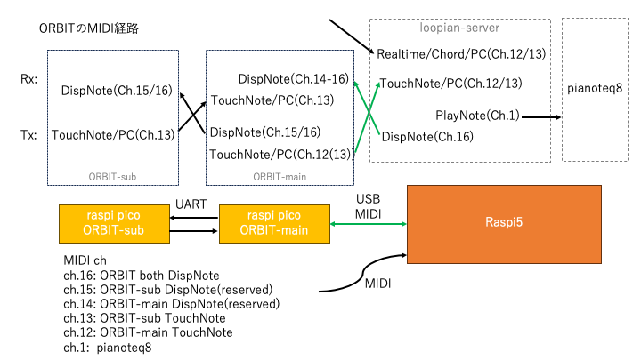

# Loopian::ORBIT v.2 Spec.

## Loopian::ORBIT とは

- Loopian::App に接続して使用する、円周状に配置されたセンサーを持つデバイス

## MIDI仕様

- ORBIT::Sub は、MIDI ch = 13 でNote情報を送る
- ORBIT::Main は、MIDI ch = 12 でNote情報を送る
- Sub/Main 両方とも、MIDI ch = 16 のNote情報を受信したら、Note番号の位置にある White LED を光らせる
    - なお、MIDI ch = 14 を受信したときは Main が、MIDI ch = 15 を受信したときは Sub が、White LED を光らせる
- 従って、ORBIT::Main から Sub に送る MIDI 情報は以下のようになる。
    - 受信した Server からの LED 用のNote情報をそのまま Sub に送る。
    - 受信した Sub からのNote情報をそのまま Server に送る。