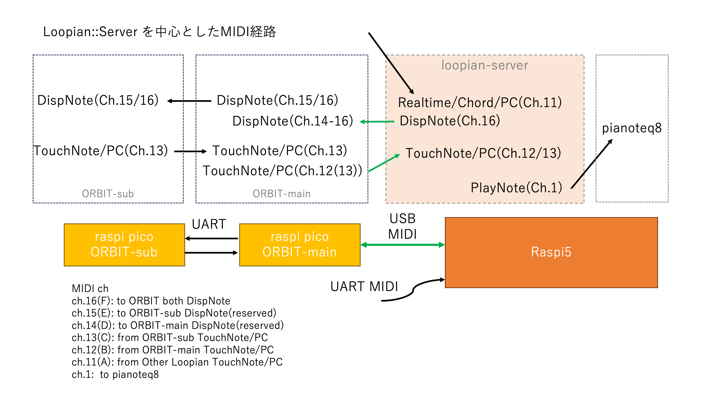

# Loopian::ORBIT v.2 Spec.

## Loopian::ORBIT とは

- Loopian::APP に接続して使用する、円周状に配置されたセンサーを持つデバイス
- ORBIT は、APP と繋げることで以下のような機能を実現する
    - ORBIT をタッチしたときに、APP が現在流している音楽（伴奏）に沿った音を鳴らすことができる
    - APP は、ORBITの任意の位置のLEDを光らせることができる
        - 今鳴っている音楽に合わせてLEDを光らせる

## Loopian::APP の立ち上げ方

- ORBIT と APP の接続方法
    - PCと繋ぐ場合、ORBITのマイコンのUSBをPCに挿し、Loopian::APP を立ち上げればよい
    - Raspberry pi5 （以下 Raspi）と繋ぐ場合、ORBITのUSBを Raspi に挿し、APPは以下のように準備する

- 実行方法
    - Raspi でターミナルを立ち上げる
    - `./autostart_loopian.sh` とタイプすると、Pianoteq8と同時に立ち上げる
    - 上記シェルスクリプト中では、 `loopian server` とオプションスイッチで `server` をつけている

- 終了方法
    - Loopian::ORBIT の Joystick を長押しし、コマンドモードにした後 `E` を選んで、再度ボタンを押す
    - Raspi の内部に取り付けたタクトスイッチを押す（Server用終了ボタン）

- ビルド方法
    - /home/pi/loopian/Loopian_Rust に移動
    - `git pull` でリポジトリから最新バージョンを落としてくる
    - `cargo build --release --features raspi`  ビルドを行う

- 立ち上げ時の原因不明な不具合について
    - Raspi を立ち上げ、最初に `loopian server` を立ち上げると、謎のMIDI Deviceが出現し、動作不良が起きる
    - 上記を防ぐため、電源投入後一度 loopian を立ち上げ、終了させる。その後起動すれば正常動作する。

## MIDI仕様

- ORBIT::Sub は、MIDI ch = 13 でNote情報(number:00-5Fh)/Damper情報/PC情報(0-17)を送る
- ORBIT::Main は、MIDI ch = 12 でNote情報(number:00-5Fh)/Damper情報/PC情報(0-17)を送る
- Sub/Main 両方とも、MIDI ch = 16 のNote情報(number:15-6Ch)を受信したら、Note番号の位置にある White LED を光らせる
    - なお、MIDI ch = 14 を受信したときは Main が、MIDI ch = 15 を受信したときは Sub が、White LED を光らせる
    - ch = 14/15 で光らせる機能は、Main/Sub を個別に光らせたい場合の予備機能
- 従って Loopian::App は ORBIT より以下のMIDI情報を得る
    - MIDI ch=12/13 によるNote情報(number:00-5Fh)
    - Damper情報
    - PC情報(0-17)

## Loopian 受信時の処理

### PC情報

- PC情報が来た場合、/ptn フォルダ内の n.lpn が再生される
    - n.lpn の n は、PC受信の 0-15 の16種類
- PC = 16 のときは、Raspi で動作する Loopian::App は終了する
- PC = 17 のときは、Loopian::App は、ターミナルによるコマンド入力になる

## Loopian::AppのMIDIプログラム

- Loopian::App立ち上げ時のMIDI周りの表示は以下の意味である
    - 用例> N: ----- <as XXX>
    - N は、Output/Input それぞれのつづき番号
    - ----- は接続したポートの名前
    - <as Piano> : Piano音源を鳴らすための出力ポート(1ch)
    - <as LED> : LEDを光らすための出力ポート(16ch)
    - <as Ext> : 外部のLoopianへの出力ポート(11ch)
    - <as Flow> : ORBITなどから送られてくるMIDI外部操作(12,13ch)
