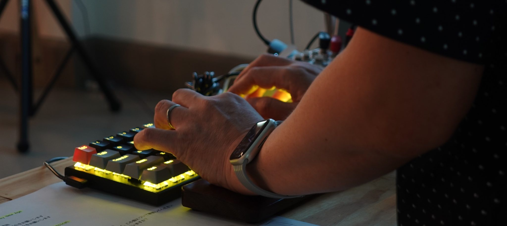

# 鴨江アートセンター2025/2/1-8開催 〜ピアノ曲をプログラミングする〜 ワークショップ参加者の方へ

ワークショップにご参加いただきありがとうございます！  
ワークショップ前の準備、開催中のリンクなど、各種情報をお知らせいたします。

事前準備

## PC持参でお願いします

- WSでは、PCにLoopianをインストールして、それを操作することで音を出したり、作曲をしていきますので、Note PCが必要になります
- 複数人が同時に音を出すため、各自の音をヘッドフォンを聴きながらワークショップを進めます。従って、ヘッドフォンをPCに接続して使えるようご用意をお願いします。
- 上記の準備が難しいようでしたら、事前にご相談ください。

## Loopianの事前インストールをお願いいたします

- 以下のページにインストールの案内がありますので、説明の通りにインストールをお願いいたします。
    - [Releaseページ](https://github.com/hasebems/Loopian_Rust/releases)

Workshop向け情報

## リンク集

- 
- 
- 
- 

## メモ

- メモ帳、テキストエディット、あるいはお好みのエディタを立ち上げておくと便利です
    - Loopianのテキスト入力では、`ctrl+v` でテキストを貼り付けることができます
- WS中は、ヘッドフォンからの音とファシリテータの声を両方聞けるよう、ヘッドフォンは片耳のみにしておくと便利です

Discordで情報交換しませんか

## LoopianのことやDTMの話題を語り合う場所を作りました

- DiscordというSNSを利用して、自作品を紹介したり、情報交換などをしませんか
- 以下のサイトより説明を読んでいただき、アカウント作成をお願いします
    - アカウント作成は、サインインから、「アカウント登録」を選んでください
        - https://support.discord.com/hc/ja
    - 使い方は以下参照ください
        - [Discordの基本　はじめに](https://support.discord.com/hc/ja/sections/360008206871-%E3%81%AF%E3%81%98%E3%82%81%E3%81%AB)
- 以下のサーバー（特定の仲間が集まる場所）に参加お願いします
    - [サーバーへの招待URL](https://discord.gg/4kVze52DGt)

