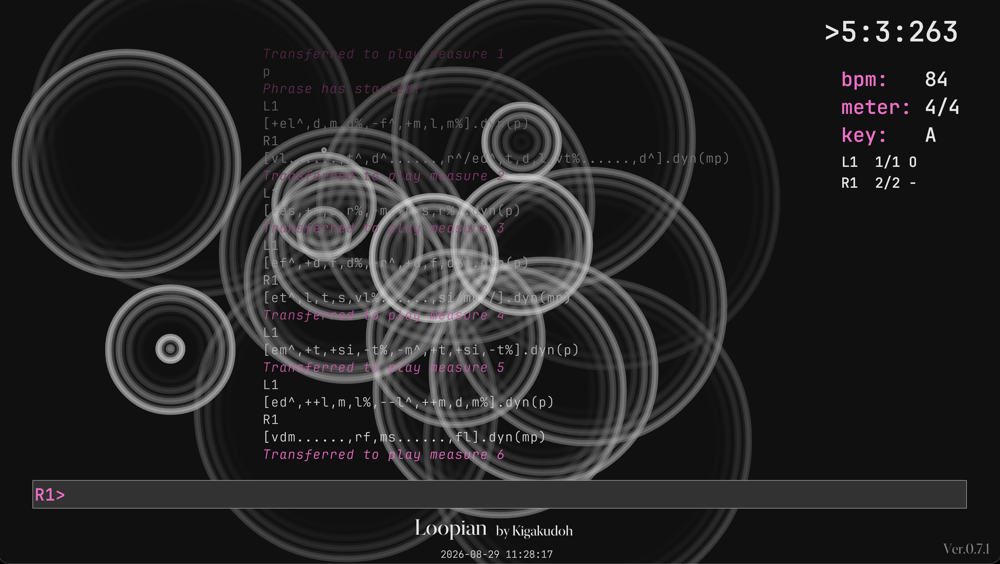
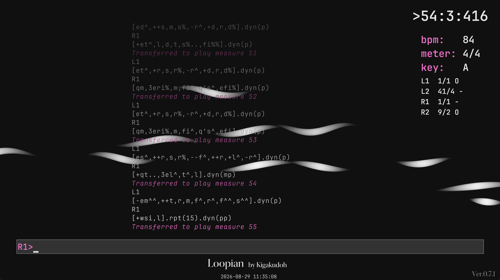
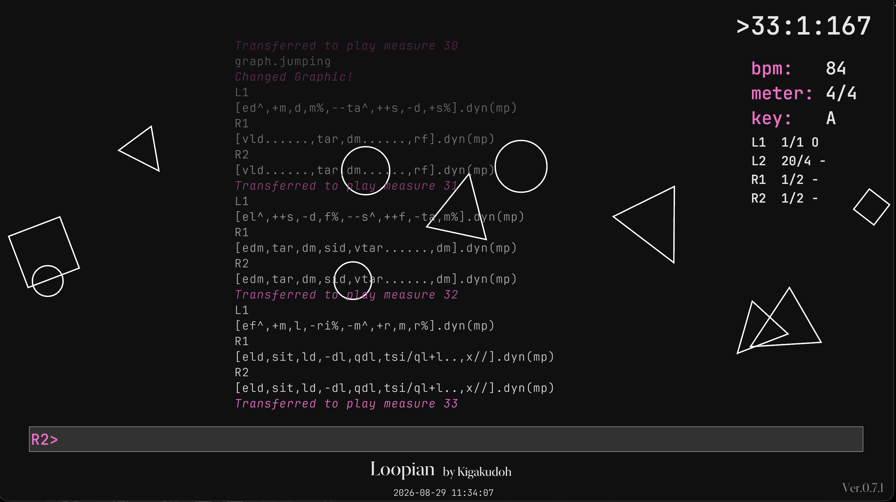
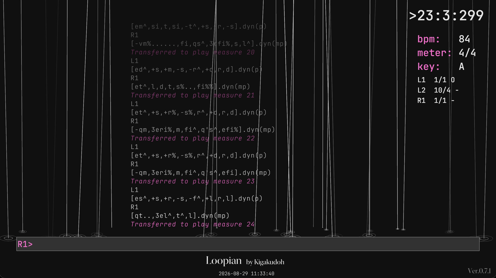
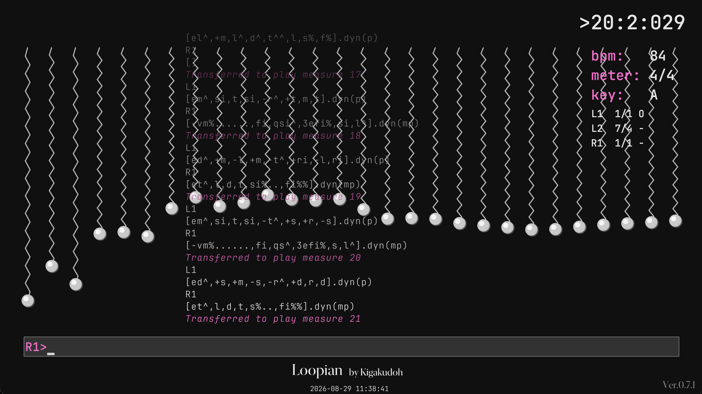
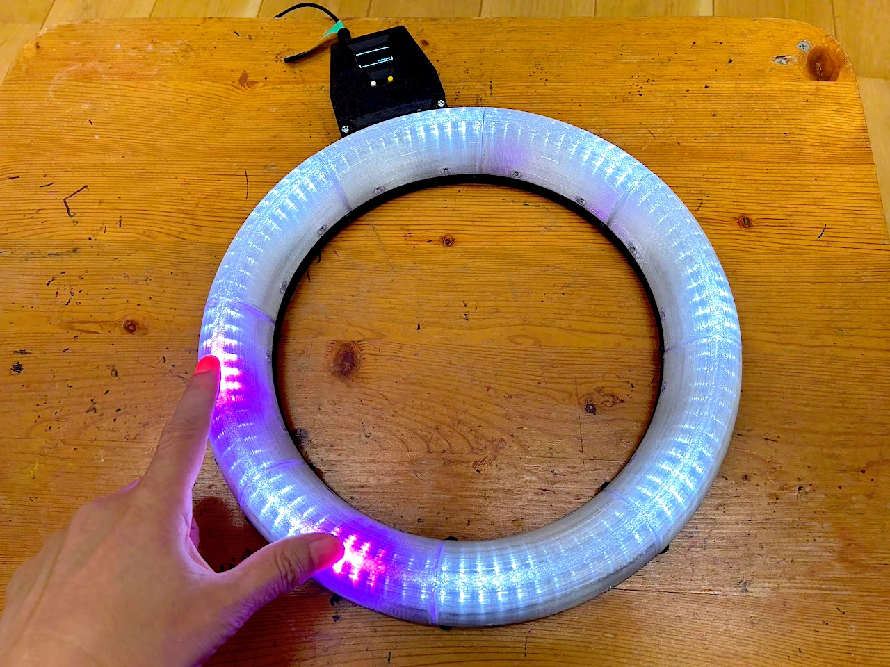

[日本語はこちら](#loopian-とは)

## [You can watch my performances on YouTube here.](https://youtube.com/playlist?list=PLUerrAh-bsOWs2xvYudPrxicXUfWKq6BX&si=wxtJ2tmU8dMsnStj)



# About Loopian

`Loopian` is a text-based piano sound sequencer being developed for use in activities like Live Coding. It has the following features:
- Text is input line by line, allowing you to specify phrases, chords, or control the overall performance with commands.
- To achieve a somewhat natural performance, the velocity, pitch during chord changes, and damper pedal usage are automatically calculated.
- Phrases are specified using movable-do solfège.
- [Loopian Reference Manual](doc/manual_en.md)

# Installing and Launching Loopian

## Installation
- Download `loopian_win.zip` (Windows) or `loopian_mac.zip` (Mac) from the [Releases page](https://github.com/hasebems/Loopian_Rust/releases).
- After downloading, unzip it into any folder — it's ready to use right away.

## Launching and Quitting
- Double-click the `loopian` file to launch the app.
- On Windows, it is set up to play sound automatically through Microsoft GS Wavetable Synth.
- On Mac, IACDriver is configured, so sound will play once you open an app such as GarageBand.
- To quit, close the window, or type `!q` in the input area and press Return.

# Introduction to Loopian Notation

## The Loopian Project

Loopian is the overall name for the project: an original text-based music notation, the app that runs it, and the related peripheral devices.
The original notation used inside the app is called Loopian Notation, developed mainly for practicing Live Coding.
Live Coding is a performance in which music is generated by writing program code in real time.
The audience doesn't just listen to the music — through a projected screen, they can also watch the code being written live and see how the sound is reflected in the visuals.
In this way, Live Coding treats the act of writing code itself as a performance.

The Loopian system works the same way: you enter musical information as text and change the music in real time.
It also displays graphics in the background, synchronized with the music currently playing.

<p float="left">
  
  
  
  
</p>

However, unlike typical Live Coding systems, Loopian doesn't use a programming-language style of text input. Instead, you enter musical instructions one line at a time, much like typing commands into a terminal.
Because of this, Loopian has a few characteristics that set it apart from other Live Coding systems. Here are its main features:

- As mentioned above, instructions are entered one line at a time, and the app responds with a line of text for each input — creating an interface that feels like chatting with the app.
- It handles piano sounds only, and its detailed specification is designed with piano performance in mind — so it tends toward calm, classical-sounding music.
- Pitches are specified not by note names or numbers such as C, D, E, F..., but by movable-do solfège syllables (do, re, mi, fa, sol, la, ti).
- Loopian Notation is built to stay close to the underlying structure of music, so it may also find future use in music education.

The Loopian system currently consists of a dedicated PC app, "Loopian::APP," and a companion hardware device, "Loopian::QUBIT."
Loopian::APP embodies the core philosophy of Loopian, so the app itself is often simply called "Loopian."
More apps and devices built on this same philosophy may appear in the future.



## Features of Loopian Notation

Loopian Notation has several features that set it apart from conventional music notation and other Live Coding systems.

- Pitches are specified not with note names such as C, D, E, F..., but with movable-do solfège syllables (`d, r, m, f, s, l, t`).
- Chord roots are specified with Roman numerals (`I, II, III...`) representing the distance from the tonic, regardless of key — so a chord progression can be written the same way even after a modulation.
- Notes are written as text by placing a note value and a pitch next to each other. For example, the famous melody from Beethoven's Ninth can be written like this:

```
[qm,m,f,s/s,f,m,r/d,d,r,m/q'm,er,hr]
```

- Loopian plays back in loops by default. Melody and chords can be layered as independent loops, and when the chord changes, the melody currently playing is automatically transposed to fit the new chord.

For the full notation — including note values, chord notation, and meter/tempo/key settings — and the complete command list, see the [Loopian Reference Manual](doc/manual_en.md).

# Loopian とは

Loopian は、Live Coding などで使うために開発している、テキスト入力によるピアノ音色用シーケンサです。
以下の特徴があります
- テキストは1行単位で入力し、フレーズや和音を指定したり、演奏全体をコントロールするコマンドを指定
- ある程度自然な演奏になるように、ベロシティや和音変換時の音程、ダンパーペダルを自動算出
- フレーズは移動ドにて指定
- [Loopian Reference Manual](doc/manual.md)


# Loopian のインストールと起動方法

## インストール方法
- [Release ページ](https://github.com/hasebems/Loopian_Rust/releases)より、OSがWindowsの方は loopian_win.zip を、Macの方は loopian_mac.zip をダウンロードしてください。
- ダウンロード後、任意のフォルダで展開すればすぐに使用可能です。

## 起動方法、終了方法
- loopian というファイルをダブルクリックすれば、起動します。
- Windowsの方の場合、Microsoft GS Wavetable Synth が自動で鳴るようにセッティングされています。
- Macの方の場合、IACDriver が設定されているので、GarageBand などのアプリを起動すれば音が鳴るようになります。
- アプリ終了は、Windowを閉じるか、入力スペースに `!q` と書いて return を押してください。

# Loopian記法の紹介

## Loopianについて

Loopian は、テキストによるオリジナルの音楽記述記法と、それを動作させるアプリ、及び関連する周辺デバイスを総合した、プロジェクト全体の総称です。
アプリの中で使われるオリジナルの記法をLoopian記法と呼びます。主にLive Codingを実践するために開発しました。
Live Codingとは、リアルタイムにプログラムを書くことで音楽を生成していくパフォーマンスのことです。
観客は音楽を聴くだけでなく、プロジェクターで投影された映像を通して、プログラムがリアルタイムに書かれていく様子や音が映像に反映している様子を見ることができます。
このようにLive Codingでは、プログラムを書くことそのものを、パフォーマンスとして捉えます。

Loopianシステムも同様に、テキストで音楽情報を入力し、リアルタイムに音楽を変えていくことが可能です。
また、アプリの背景に再生中の音楽にシンクロしたグラフィックを表示します。

<p float="left">
  
  
  
  
</p>

ただし、Loopianは一般的なLive Codingのシステムとは違い、プログラミングの形式でテキストを入力するのではなく、ターミナル等で一行ずつコマンドを入力するように、一行ごとに音楽的指示を入力していきます。
このように、Loopianには、他のLive Codingシステムとは若干趣きの違う幾つかの特徴があります。
以下に、Loopianの主な特徴を挙げてみましょう。

- 上述のように、指示は一行単位で入力し、アプリは一行ごとに文字列で反応を返します。あたかもアプリとチャットしているようなインターフェースとなっています。
- 基本的にピアノ音色のみを扱います。詳細な仕様はピアノ音色を鳴らすことを意識して設計されています。このため比較的落ち着きのあるクラシカルな雰囲気の音楽を志向します。
- 音程の指示は、C,D,E,F...といった音名や数値ではなく、移動ドの考えに基づき、ドレミファソラシドの階名によって指示します。
- Loopian記法はより音楽の仕組みに寄り添った体系となっており、将来的には教育分野でこの記法を利用するといった使い方も考えられます。

現在Loopianのシステムには、PC上で動作する専用アプリ"Loopian::APP"と、アプリと連携して動作するデバイス"Loopian::QUBIT"が存在します。
Loopian::APPは、Loopianの思想を体現する中核を成しているので、このアプリを単にLoopianと呼んでも構いません。
今後も、このLoopianの思想に基づいた様々なアプリ、デバイスが出現する可能性もあります。


## Loopian記法の特徴

Loopian記法には、一般的な音楽記譜や他のLive Codingシステムと違う、いくつかの特徴があります。

- 音程は、C,D,E,F...のような音名ではなく、移動ドの考え方に基づき「ドレミファソラシド」の階名（`d,r,m,f,s,l,t`）で指定します
- 和音の根音は、調によらず主音からの距離をローマ数字（`I, II, III...`）で指定します。転調してもコード進行の書き方を変える必要がありません
- 音符は音価と音程を並べてテキストで表現します。例えば、ベートーヴェンの第九の有名な旋律は次のように書けます

```
[qm,m,f,s/s,f,m,r/d,d,r,m/q'm,er,hr]
```

- Loopianは基本的にループ再生を行います。旋律と和音はそれぞれ独立したループとして重ねることができ、和音を切り替えると、鳴っている旋律も自動的にその和音に合った音程へ変換されます

音価や和音の表記、拍子・テンポ・調の設定方法など、より詳しい記法や全コマンドについては、[Loopian Reference Manual](doc/manual.md) を参照してください。
