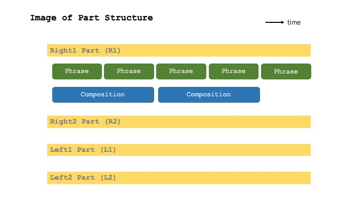

<!--

-->

loopian Alpha-version written in Rust
========================================

about loopian
--------------

'loopian' is a sequencer for piano tones with text input that we are developing for use mostly in Live Coding.

loopian とは
------------

loopian は、Live Coding などで使うために開発している、テキスト入力によるピアノ音色用シーケンサです。
以下の特徴があります
- テキストは1行単位で入力し、フレーズや和音を指定したり、演奏全体をコントロールするコマンドを指定
- ある程度自然な演奏になるように、ベロシティや和音変換時の音程、ダンパーペダルを自動算出
- フレーズは移動ドにて指定

用語集 (Glossary)
-------------------

- 階名 : 移動ドによる音程呼称。ドレミファソラシドが示す音は、調によって移動する。
- phrase : メロディや和音など、時系列の音符情報
- composition : phrase に適用して音を変化させる Chord/Scale 情報
- loop : loopian は基本的に、phrase/composition を繰り返す。この繰り返し単位。
- part : phrase/composition はそれぞれ独立した４つの Loop 再生が可能である。その４つを part と呼ぶ。
    - 各 part は left 1(L1)/left 2(L2)/right 1(R1)/right 2(R2) という名前で示される。
    - 1 part あたり、一つの phrase と一つの composition が個別の周期で loop する

起動と終了
--------------

- 起動
    - './target/release/loopian_rust'  : 起動アプリ名は loopian_rust
- 入力
    - '000: L1> ' : 入力用プロンプト
        - 000: は入力したコマンド history の現在の順番を表している
        - L1> は Left 1 の入力状態であることを示す
        - このプロンプトの後に、コマンドやフレーズを書き込み、Return で入力する
    - カーソル（上下）による過去入力のヒストリー呼び出しが可能
- 終了
    - 'quit' : 終了
    - ウインドウの close ボタンを押しても終了

音を出すための外部環境
--------------------

- 外部 MIDI 音源を繋ぐ
- マルチパートで MIDI受信するアプリを同時に起動する。以下のアプリで動作確認済。
    - Logic : Mac で MIDI 演奏するための DAW by Apple
    - Pianoteq8 : 物理エンジンベースのPiano音源 by MODARTT
- 専用MIDI Controller(Loopian::ORBIT)を接続し、リアルタイム演奏も可能

再生コントロール
--------------

- 'play','start' : シーケンス開始(1小節目から)
- 'fermata' : 次の小節の頭の拍を再生してbeatを止める
- 'resume' : beatが止まっているとき、次の小節から再生を再開する
- 'stop','fine' : 直ちにシーケンス終了
- 'rit.' : テンポをだんだん遅くして、次の小節の頭で元のテンポ
    - rit.poco   : rit.の遅さが弱い
    - rit.molto  : rit.の遅さが強い
    - rit./fermata  : rit.の次の小節の頭の拍を再生して停止(stopで終わる)
    - rit.molto/fermata
    - rit./120   : rit.の次の小節をテンポ120で開始
- 'sync' : 次の小節の頭で、ループ先頭に戻る
    - sync       : そのパート(Phrase,Composition)のみ
    - sync right : 右手パート(right1/2)
    - sync left  : 左手パート(left1/2)
    - sync all   : 全パート

入力環境コマンド
----------------

- 'right1' 'left1' : Phrase, Composition の入力パートを指定。右手２パート、左手２パートの４パートを指定可能
- 'panic' : 今鳴っている音を消音する

Phrase 追加
-------------

- [*note*][*musical expression*] : phrase 追加の書式
    - *note*: 音符ごとの階名、音価表現、音量情報を入力する
    - *musical expression*: 音楽表現を入力する
        - [*musical expression*] は省略可能
    - [] : 全データ削除

- noteの階名表現
    - d,r,m,f,s,l,t: ド、レ、ミ、ファ、ソ、ラ、シ
    - di,ri,fi,si,li: ド#、レ#、ファ#、ソ#、ラ# (iをつけると半音高くなる)
    - ra,ma,sa,la,ta: レb、ミb、ソb、ラb、シb (aをつけると半音低くなる)
    - -d : 1オクターブ下のド、 +d: 1オクターブ上のド、--d: 2オクターブ下、++d: 2オクターブ上
    - x : 休符
    - , : 各音の区切り。１小節を超えたら捨てられる。区切りが連続すると休符が省略されたとみなす
    - |, / : 小節区切り。区切りが連続すると休符が省略されたとみなす
    - d=m=s, d_m_s : 同時演奏
    - <d,r,m>*4 : ドレミを４回演奏
    - d*4 : ドを４回連続して発音

- noteの音価表現
    - 基準音価とは、何も音価設定しないで階名を入力したときの音価のこと
        - デフォルトの基準音価は四分音符
    - do| : ドをその小節の終わりまで伸ばす（oから|までの間の文字は無視される） 
    - d.. / d~~ : ドを基準音価の３倍（もう２回）伸ばす 
        - d.|.. のように小節を跨ぐこともできる（タイ）
        - do|o| は２小節伸ばす
    - [hd,qd,'d,"d,'"d] : h:二分音符、q:四分音符、':八分音符、":十六分音符、'":三十二分音符
        - 一度上記の印をつけたらこの指定がこのPhraseの基準音価となり、別の記号がつかない限り以降はこの音価とみなされる
        - [3'd,r,m] : 'の前に3を書くと、３連符の音価になる
            - 同様に、5連符が可能

- note単位の音量表現
    - d^ : 階名の後ろに '^' をつけると音量が大きくなる。複数個つけることも可能
    - d% : 階名の後ろに '%' をつけると音量が小さくなる。複数個つけることも可能

- 音楽表現(musical expression)
    - f,mf,mp,p,pp: フレーズの音量
    - stacc: 音価を半分にする
    - para : 和音変換時、root に合わせて並行移動する 
    - noped: Pedal Off指定

Composition 指定
----------------------------

- {*chord*} : Composition の書式
    - *chord*: コードを小節ごとに / で区切って時系列で記述
    - {} : 全データ削除

- 長さの指定方法
    - '|' '/' : 小節区切り。区切りが連続するとコードがないとみなす
    - {I|IV|V} : １小節ごとに I -> IV -> V とコードが変わる
        - '|.|' 小節線の間にピリオドを入れると、前の小節と同じコードになる
    - 同小節内でコードを変える場合、拍ごとに','で区切る。
        - 複数拍を同じコードにしたい場合、'.' で伸ばす
        - ',,' のように何も記さずにカンマを続けた場合、その拍にコードがないとみなす
    - コード情報とピアノの Pedal 情報はリンクしている
        - コードが空白、あるいは 'thru' の場合、ペダルは踏まれない
        - コードが変わるごとにペダルは踏み直される
        - 小節が変わるごとにペダルは踏み直される

- コード記述方法
    - O : original phrase
    - I : d=m=s (Iの和音)
        - ローマ数字: I, II, III, IV, V, VI, VII
    - I# : di=mi=si (数字の後に # を付けると半音高いコードになる。b は半音)
    - V : s=t=r (Ⅴの和音)
    - VIm : l=d=m (m: minor)
    - IVM7 : f=l=d=m (M7: major7th)
    - IIIm7-5 : m=s=ta=r (m7-5: minor7th -5th)
    - diatonic : d=r=m=f=s=l=t (Diatonic Scale)
    - lydian : d=r=m=fi=s=l=t (Lydian Scale)
    - Iion : Iを主音としたイオニアン(Ionian)
    - thru : 全ての音(pedalなし)
    - コードやスケールが判断不能の場合、Errorとなり主音しか出ない

Phrase/Composition 二つに関係する書式
---------------------------------------

- Phrase/Composition ともに、冒頭でパート指定することで、プロンプトと違うパートでも入力することができる
    - L1> : left1パート
    - L12> : left1,left2パート二つ同時に同じ Phrase をセット
    - ALL> : 全パートに同じ Phrase をセット

- Phrase の Variation 追加と、Composition での指定
    - Variation 機能では、ある Phrase の Loop 中に、別の Phrase(Variation) をときおり再生することができる
    - @n[..][..] : Phrase 指定の冒頭に @n(nは1から9までの数値)を付け足すことで、Variation を追加できる
    - 追加された Variation Phrase は、Composition で指定する
        - {I/@n;II} 小節線の直後に @n;(n:1-9) と書くと、この小説冒頭から Variation Phrase が再生される
        - Composition で指定した場合、前の Phrase が途中でも中断し、Variation Phrase を再生する
        - Composition が先に終了しても、Variation Phrase が残っていれば、そのまま再生を続ける
        - Variation Phrase が終了後、新しい Variation 指定がなければ、通常の Phrase が再生される

調、テンポ、拍子、音量
-------------------

- 'set bpm=100' : BPM（テンポ）=100 にセット
- 'set beat=4/4' : 拍子を 4/4 にセット
- 'set key=C4' : key を C4 にセット
    - loopian にとって key とは [d]（ド） と指示されたときの音名を表す
    - デフォルト値は C4(midi note number=60)
    - 音名は C-B と大文字で表現し、必要に応じて前に #, b を足すことができる
    - 音名の後ろの数値はオクターブを指示するが、省略可能
        - 省略した場合、今設定されているオクターブがそのまま適用される
- 'set oct=+1' : 現状から１オクターブ上げる
    - set 以降に all を付け足すと、全 part に効果、付けなければ入力中の part に対してのみ効果
    - 'set oct=0,0,-1,+1' : 4つのパートのオクターブを一度に設定できる
- 'set input=fixed' : 階名を入力したときのオクターブ決定法（和音入力の場合はfixedのみ）
    - fixed は、入力する階名の位置は固定
    - closer は、指示がない限り、前回に近い音程 (default)
- 'set samenote=modeling' : 同音連打の動き方
    - modeling は、モデリング音源向けで、note off は一度しか送らない（default）
    - common は、一般的なMIDI音源向けで、note off は note on の数だけ送られる
- 'set turnnote=5' : para 指定時、変換後の音程を折り返す位置(0-11, default=5)

ファイルのロード、セーブ
--------------------------

- Loopian を終了すると、自動的にログファイルがセーブされる
    - アプリのあるフォルダに、/log フォルダが自動的に作られ、その中にログファイル（拡張子はlpn）がセーブされる
    - 2023-06-02_19-56-54.lpn というように、日時がファイル名となる
- プロンプトに 'load xxx' と書くと、ファイルがロードされる
    - 最初のloadコマンド入力時、アプリのあるフォルダに、/load フォルダが自動的に作られる
    - ロードファイルの拡張子はlpn限定で、ファイル指定にlpnを書く必要はない
    - loadしたいファイルは、この /load フォルダに入れておく必要がある
    - ログファイルと同様のファイルがロードされることを想定している
    - ロードされた内容は、history の中に格納され、カーソル（上下）キーで一行ずつ呼び出すことができる

Loopian::ORBIT での演奏
--------------------------

- 'flow' 'endflow' : Loopian::ORBIT を接続した場合、そのパートに Loopian::ORBIT からの演奏情報を入力したり、解除したりする

アプリの内部で自動的に行われること
-------------------------------

- 指定されたコードに合わせて、音程を自動変換する
    - 単音の連続する八分音符以下のフレーズは、アルペジオ的奏法とみなし、なるべく同じ音が続かないようにする
- ベロシティ（音の強さ）を、拍に合わせて変化させている
- noped 指定されない限り、一番細かい和音指定に合わせて、ペダル情報を自動的に算出する

<!--
-->